# OPA技术文档项目 - Mermaid架构图集

> **适用版本**: v2.6.0
> **最后更新**: 2026年3月19日

---

## 📊 项目架构图

### 1. 整体项目架构

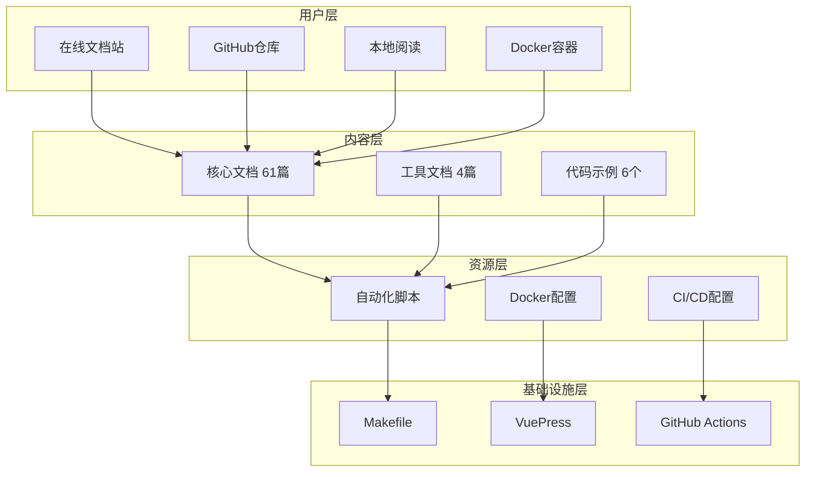
```mermaid
graph TB
    subgraph "用户层"
        A1[在线文档站]
        A2[GitHub仓库]
        A3[本地阅读]
        A4[Docker容器]
    end

    subgraph "内容层"
        B1[核心文档 61篇]
        B2[工具文档 4篇]
        B3[代码示例 6个]
    end

    subgraph "资源层"
        C1[自动化脚本]
        C2[CI/CD配置]
        C3[Docker配置]
    end

    subgraph "基础设施层"
        D1[Makefile]
        D2[VuePress]
        D3[GitHub Actions]
    end

    A1 --> B1
    A2 --> B1
    A3 --> B1
    A4 --> B1

    B1 --> C1
    B2 --> C1
    B3 --> C1

    C1 --> D1
    C2 --> D3
    C3 --> D2
```

### 2. 文档体系架构

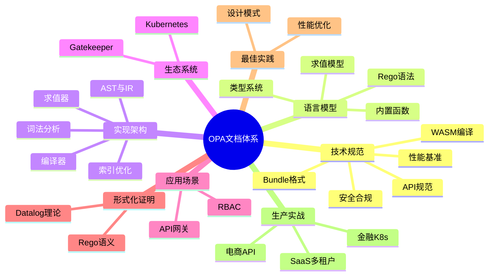
```mermaid
mindmap
  root((OPA文档体系))
    技术规范
      API规范
      Bundle格式
      WASM编译
      性能基准
      安全合规
    语言模型
      Rego语法
      类型系统
      内置函数
      求值模型
    实现架构
      词法分析
      AST与IR
      编译器
      求值器
      索引优化
    生态系统
      Kubernetes
      Gatekeeper
    应用场景
      RBAC
      API网关
    形式化证明
      Datalog理论
      Rego语义
    最佳实践
      设计模式
      性能优化
    生产实战
      电商API
      金融K8s
      SaaS多租户
```

### 3. 开发工作流

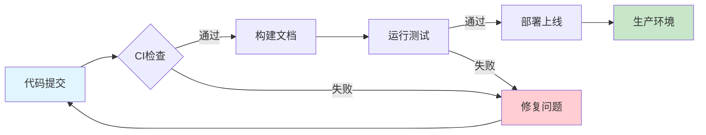
```mermaid
flowchart LR
    A[代码提交] --> B{CI检查}
    B -->|通过| C[构建文档]
    B -->|失败| D[修复问题]
    D --> A
    C --> E[运行测试]
    E -->|通过| F[部署上线]
    E -->|失败| D
    F --> G[生产环境]

    style A fill:#e1f5fe
    style G fill:#c8e6c9
    style D fill:#ffcdd2
```

---

## 🔒 安全架构图

### 4. CVE-2025-46569响应流程

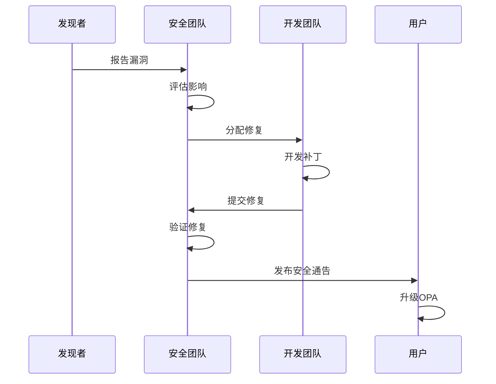
```mermaid
sequenceDiagram
    participant 发现者
    participant 安全团队
    participant 开发团队
    participant 用户

    发现者->>安全团队: 报告漏洞
    安全团队->>安全团队: 评估影响
    安全团队->>开发团队: 分配修复
    开发团队->>开发团队: 开发补丁
    开发团队->>安全团队: 提交修复
    安全团队->>安全团队: 验证修复
    安全团队->>用户: 发布安全通告
    用户->>用户: 升级OPA
```

### 5. 安全防御层次

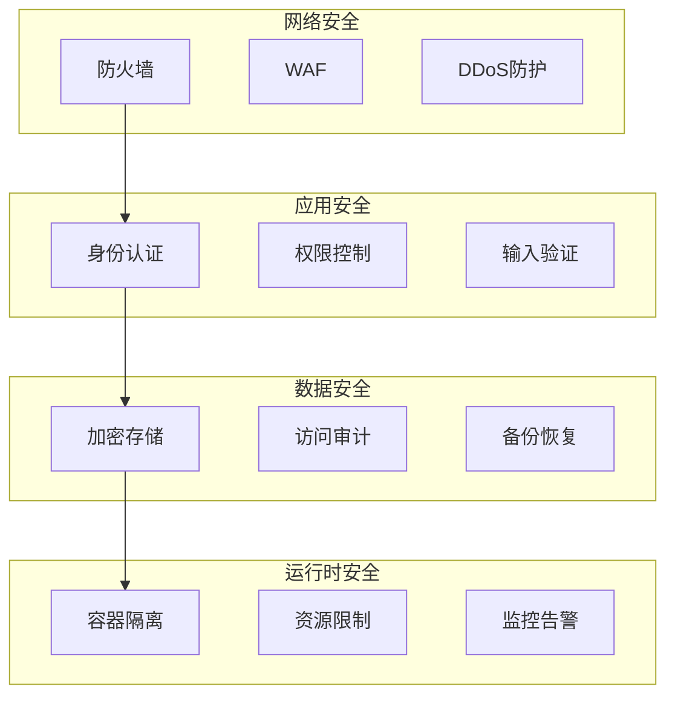
```mermaid
graph TB
    subgraph "网络安全"
        A1[防火墙]
        A2[WAF]
        A3[DDoS防护]
    end

    subgraph "应用安全"
        B1[身份认证]
        B2[权限控制]
        B3[输入验证]
    end

    subgraph "数据安全"
        C1[加密存储]
        C2[访问审计]
        C3[备份恢复]
    end

    subgraph "运行时安全"
        D1[容器隔离]
        D2[资源限制]
        D3[监控告警]
    end

    A1 --> B1
    B1 --> C1
    C1 --> D1
```

---

## ⚙️ 技术架构图

### 6. OPA内部架构

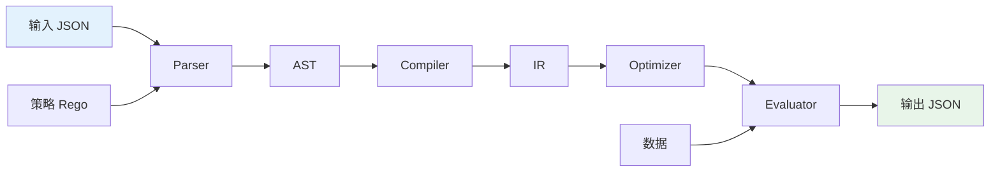
```mermaid
graph LR
    A[输入 JSON] --> B[Parser]
    B --> C[AST]
    C --> D[Compiler]
    D --> E[IR]
    E --> F[Optimizer]
    F --> G[Evaluator]
    G --> H[输出 JSON]

    I[数据] --> G
    J[策略 Rego] --> B

    style A fill:#e3f2fd
    style H fill:#e8f5e9
```

### 7. Kubernetes集成架构

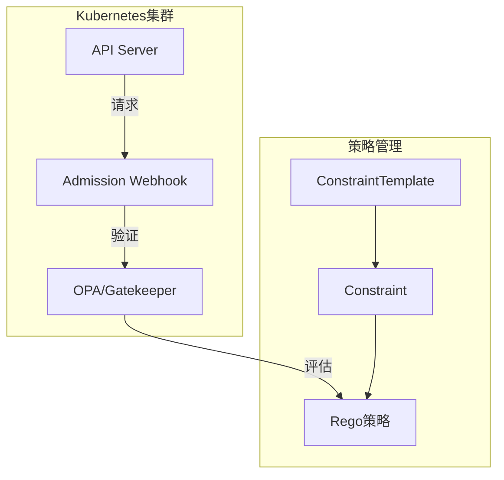
```mermaid
graph TB
    subgraph "Kubernetes集群"
        A[API Server]
        B[OPA/Gatekeeper]
        C[Admission Webhook]
    end

    subgraph "策略管理"
        D[ConstraintTemplate]
        E[Constraint]
        F[Rego策略]
    end

    A -->|请求| C
    C -->|验证| B
    B -->|评估| F
    D --> E
    E --> F
```

### 8. CI/CD流水线

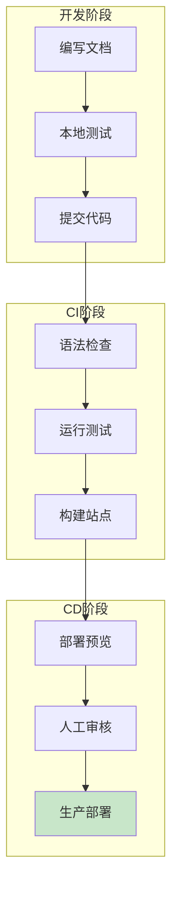
```mermaid
flowchart TB
    subgraph "开发阶段"
        A[编写文档] --> B[本地测试]
        B --> C[提交代码]
    end

    subgraph "CI阶段"
        C --> D[语法检查]
        D --> E[运行测试]
        E --> F[构建站点]
    end

    subgraph "CD阶段"
        F --> G[部署预览]
        G --> H[人工审核]
        H --> I[生产部署]
    end

    style I fill:#c8e6c9
```

---

## 📈 流程图

### 9. 策略决策流程

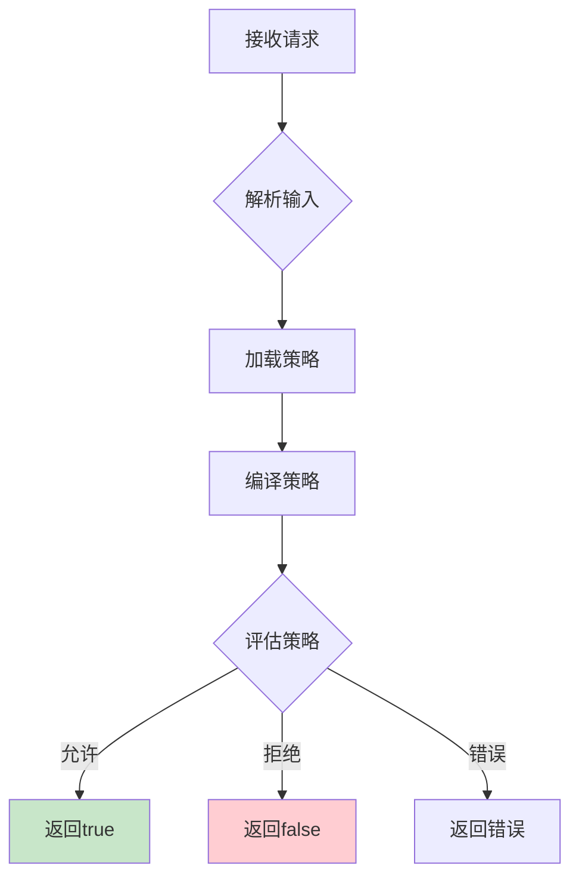
```mermaid
flowchart TD
    A[接收请求] --> B{解析输入}
    B --> C[加载策略]
    C --> D[编译策略]
    D --> E{评估策略}
    E -->|允许| F[返回true]
    E -->|拒绝| G[返回false]
    E -->|错误| H[返回错误]

    style F fill:#c8e6c9
    style G fill:#ffcdd2
```

### 10. 学习路径流程

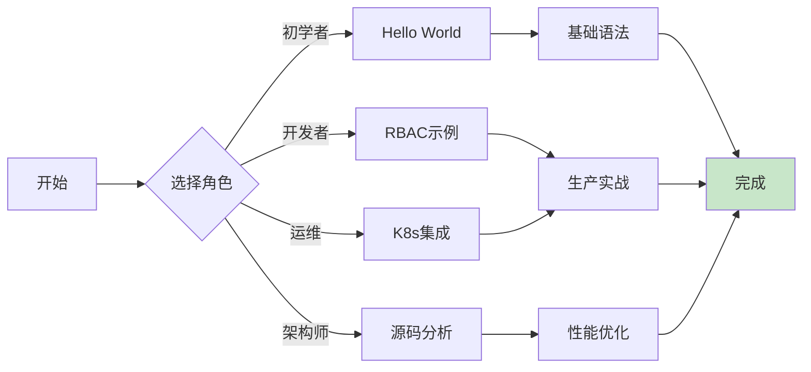
```mermaid
flowchart LR
    A[开始] --> B{选择角色}
    B -->|初学者| C[Hello World]
    B -->|开发者| D[RBAC示例]
    B -->|运维| E[K8s集成]
    B -->|架构师| F[源码分析]

    C --> G[基础语法]
    D --> H[生产实战]
    E --> H
    F --> I[性能优化]

    G --> J[完成]
    H --> J
    I --> J

    style J fill:#c8e6c9
```

### 11. 故障排除流程

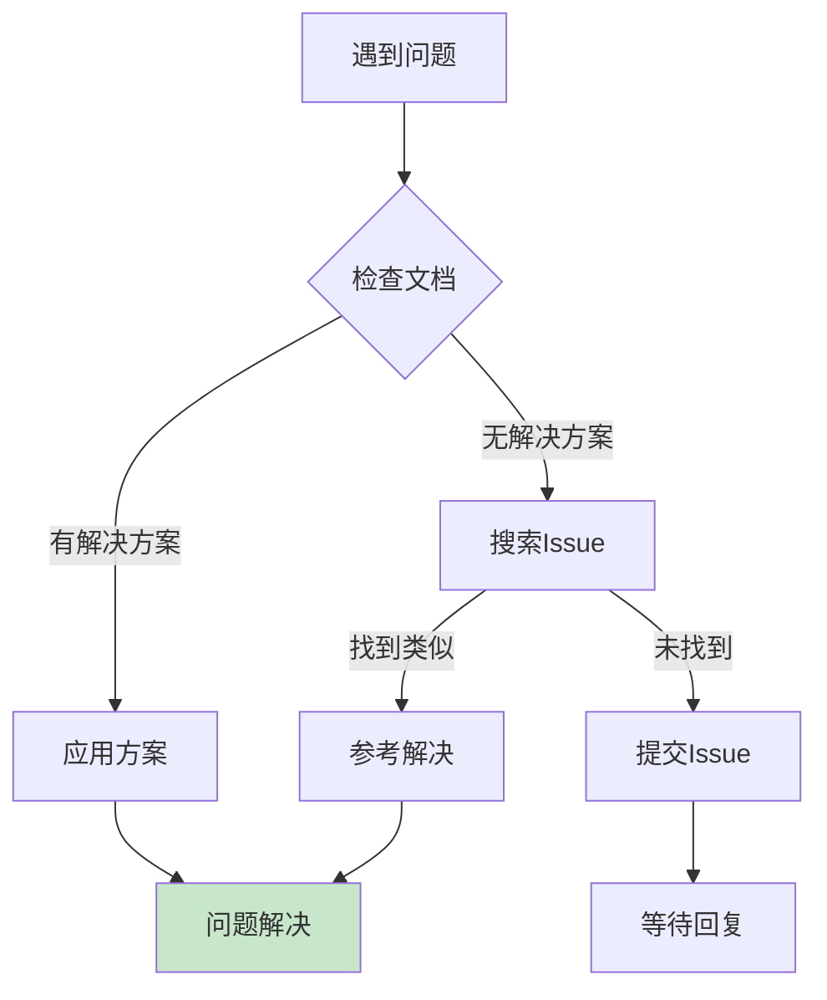
```mermaid
flowchart TD
    A[遇到问题] --> B{检查文档}
    B -->|有解决方案| C[应用方案]
    B -->|无解决方案| D[搜索Issue]
    D -->|找到类似| E[参考解决]
    D -->|未找到| F[提交Issue]

    C --> G[问题解决]
    E --> G
    F --> H[等待回复]

    style G fill:#c8e6c9
```

---

## 🎯 状态图

### 12. 项目状态转换

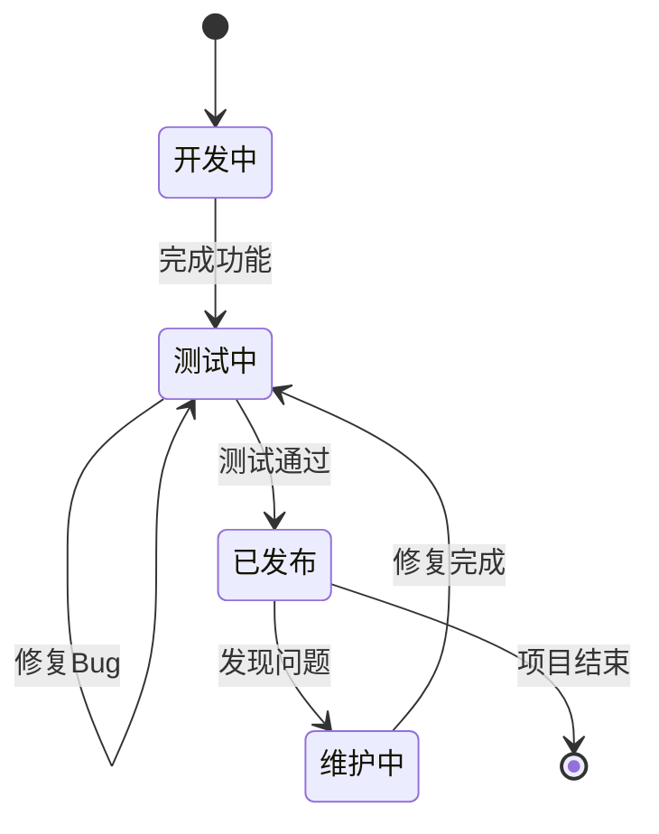
```mermaid
stateDiagram-v2
    [*] --> 开发中
    开发中 --> 测试中: 完成功能
    测试中 --> 测试中: 修复Bug
    测试中 --> 已发布: 测试通过
    已发布 --> 维护中: 发现问题
    维护中 --> 测试中: 修复完成
    已发布 --> [*]: 项目结束
```

### 13. 文档生命周期

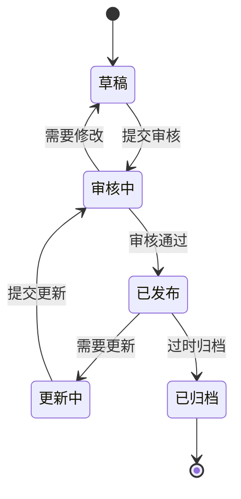
```mermaid
stateDiagram-v2
    [*] --> 草稿
    草稿 --> 审核中: 提交审核
    审核中 --> 草稿: 需要修改
    审核中 --> 已发布: 审核通过
    已发布 --> 更新中: 需要更新
    更新中 --> 审核中: 提交更新
    已发布 --> 已归档: 过时归档
    已归档 --> [*]
```

---

## 🌐 部署架构图

### 14. 多环境部署

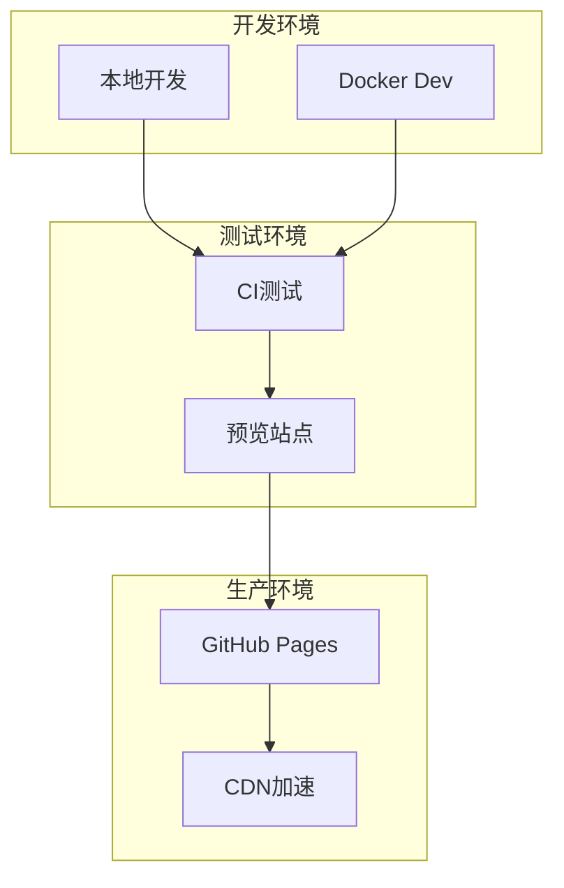
```mermaid
graph TB
    subgraph "开发环境"
        A[本地开发]
        B[Docker Dev]
    end

    subgraph "测试环境"
        C[CI测试]
        D[预览站点]
    end

    subgraph "生产环境"
        E[GitHub Pages]
        F[CDN加速]
    end

    A --> C
    B --> C
    C --> D
    D --> E
    E --> F
```

### 15. 微服务架构

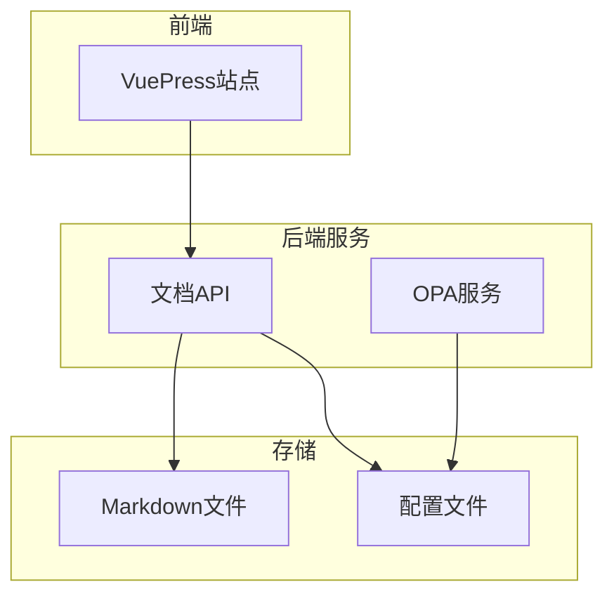
```mermaid
graph TB
    subgraph "前端"
        A[VuePress站点]
    end

    subgraph "后端服务"
        B[OPA服务]
        C[文档API]
    end

    subgraph "存储"
        D[Markdown文件]
        E[配置文件]
    end

    A --> C
    C --> D
    C --> E
    B --> E
```

---

## 📊 统计图表

### 16. 文档增长趋势

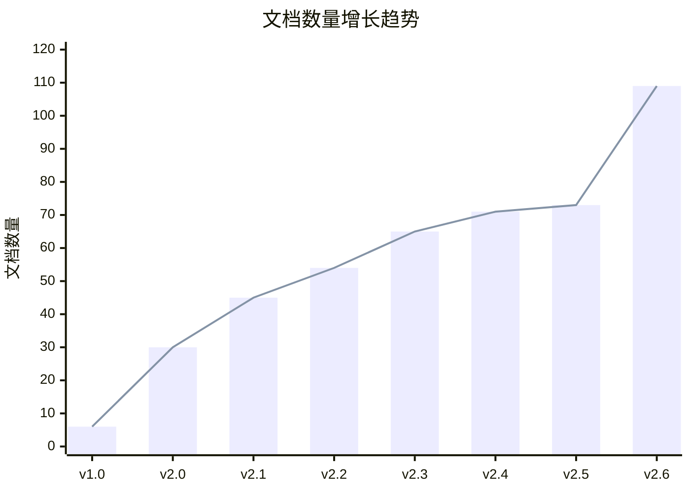
```mermaid
xychart-beta
    title "文档数量增长趋势"
    x-axis [v1.0, v2.0, v2.1, v2.2, v2.3, v2.4, v2.5, v2.6]
    y-axis "文档数量" 0 --> 120
    bar [6, 30, 45, 54, 65, 71, 73, 109]
    line [6, 30, 45, 54, 65, 71, 73, 109]
```

### 17. 章节分布饼图

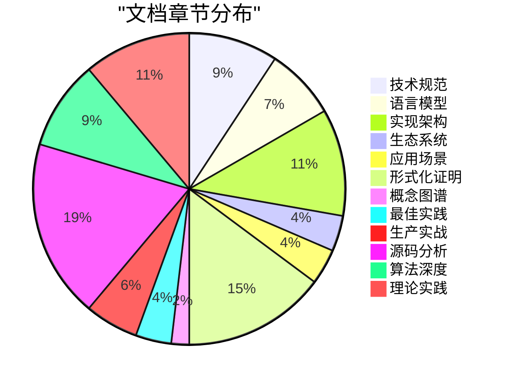
```mermaid
pie title "文档章节分布"
    "技术规范" : 5
    "语言模型" : 4
    "实现架构" : 6
    "生态系统" : 2
    "应用场景" : 2
    "形式化证明" : 8
    "概念图谱" : 1
    "最佳实践" : 2
    "生产实战" : 3
    "源码分析" : 10
    "算法深度" : 5
    "理论实践" : 6
```

---

## 🔄 时序图

### 18. 用户访问流程

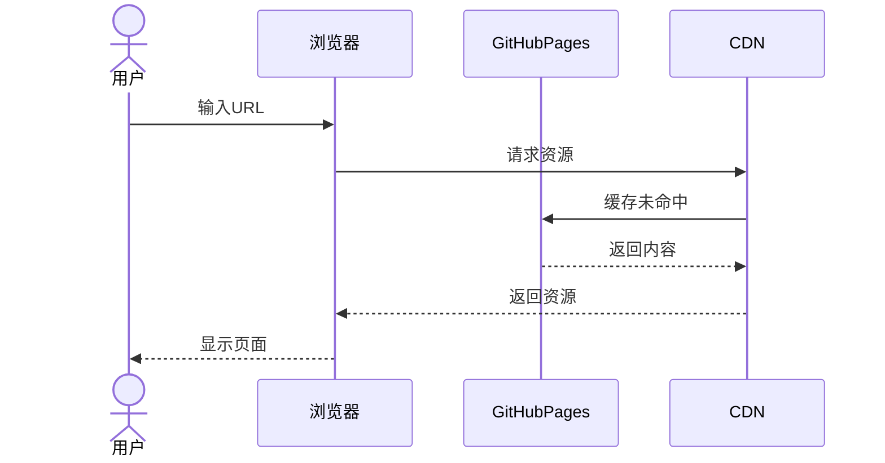
```mermaid
sequenceDiagram
    actor 用户
    participant 浏览器
    participant GitHubPages
    participant CDN

    用户->>浏览器: 输入URL
    浏览器->>CDN: 请求资源
    CDN->>GitHubPages: 缓存未命中
    GitHubPages-->>CDN: 返回内容
    CDN-->>浏览器: 返回资源
    浏览器-->>用户: 显示页面
```

### 19. 构建发布流程

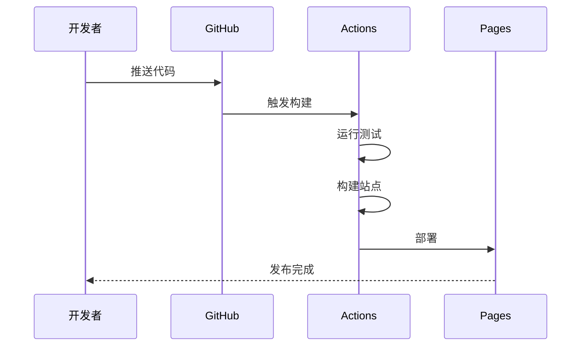
```mermaid
sequenceDiagram
    participant 开发者
    participant GitHub
    participant Actions
    participant Pages

    开发者->>GitHub: 推送代码
    GitHub->>Actions: 触发构建
    Actions->>Actions: 运行测试
    Actions->>Actions: 构建站点
    Actions->>Pages: 部署
    Pages-->>开发者: 发布完成
```

---

## 💡 使用说明

### 如何在文档中嵌入Mermaid图

```markdown
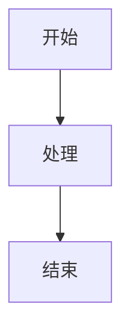
```mermaid
graph TD
    A[开始] --> B[处理]
    B --> C[结束]
```

```

### 支持的图表类型

- `graph` 或 `flowchart` - 流程图
- `sequenceDiagram` - 时序图
- `classDiagram` - 类图
- `stateDiagram-v2` - 状态图
- `erDiagram` - ER图
- `journey` - 用户旅程图
- `gantt` - 甘特图
- `pie` - 饼图
- `mindmap` - 思维导图
- `xychart-beta` - 柱状图/折线图

### 样式设置

```mermaid
graph LR
    A[节点A] --> B[节点B]
    style A fill:#e1f5fe
    style B fill:#c8e6c9
```

---

**Mermaid图集维护**: OPA中文文档团队
**最后更新**: 2026年3月19日
**版本**: v2.6.0

📊 **[查看更多图表](MERMAID_DIAGRAMS.md)** | 🏗️ **[架构设计](ARCHITECTURE.md)** | 📚 **[文档索引](PROJECT_INDEX_v2.6.0.md)**
