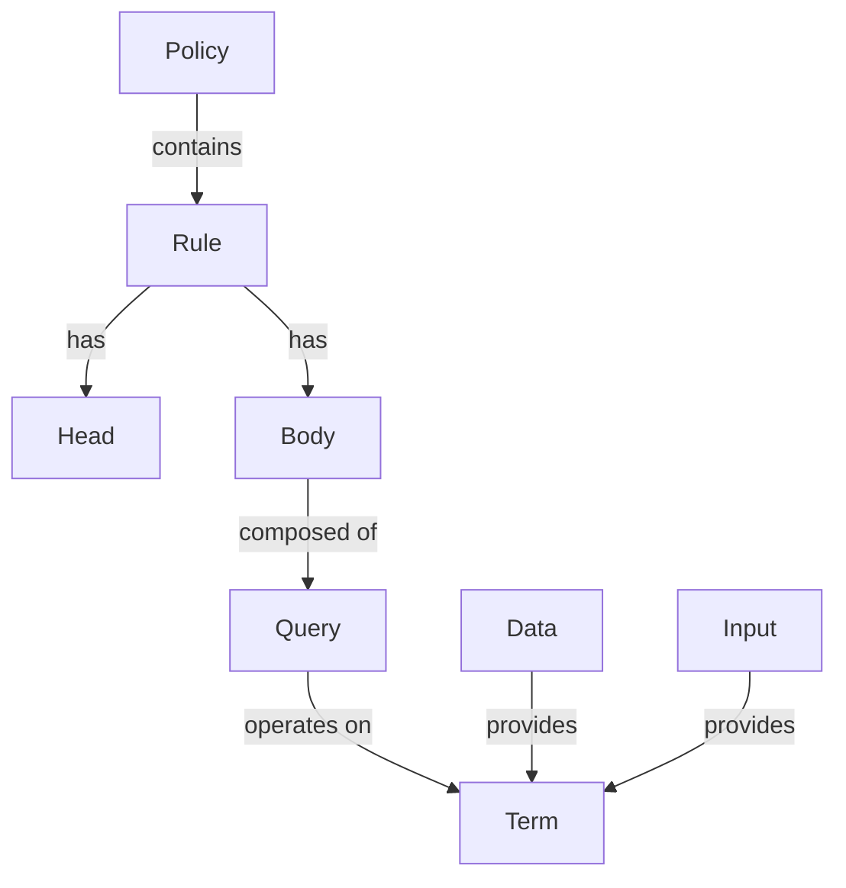

# OPA（Open Policy Agent）全面技术分析 - 总览与索引

> **更新日期**: 2025年10月21日  
> **版本**: v2.0  
> **状态**: 核心模块完成，共24篇文档

---

## 目录

- [OPA（Open Policy Agent）全面技术分析 - 总览与索引](#opaopen-policy-agent全面技术分析---总览与索引)
  - [目录](#目录)
  - [📋 文档导航](#-文档导航)
    - [文档结构](#文档结构)
  - [🎯 核心技术维度](#-核心技术维度)
    - [1. **技术规范层**（Technical Specifications）](#1-技术规范层technical-specifications)
    - [2. **语言模型层**（Language Semantics）](#2-语言模型层language-semantics)
    - [3. **实现架构层**（Implementation Architecture）](#3-实现架构层implementation-architecture)
    - [4. **生态集成层**（Ecosystem Integration）](#4-生态集成层ecosystem-integration)
  - [🔬 形式化分析框架](#-形式化分析框架)
    - [语义模型（Semantic Model）](#语义模型semantic-model)
      - [1. 语法域（Syntactic Domains）](#1-语法域syntactic-domains)
      - [2. 求值关系（Evaluation Relation）](#2-求值关系evaluation-relation)
      - [3. 核心推理规则](#3-核心推理规则)
  - [📊 概念关系图谱](#-概念关系图谱)
    - [核心概念五元组](#核心概念五元组)
      - [实体（Entities）](#实体entities)
      - [关系矩阵（Relation Matrix）](#关系矩阵relation-matrix)
  - [🏗️ 技术栈映射](#️-技术栈映射)
    - [语言实现栈](#语言实现栈)
    - [部署形态矩阵](#部署形态矩阵)
  - [🧬 递归主题展开](#-递归主题展开)
    - [主题分解树（Topic Decomposition Tree）](#主题分解树topic-decomposition-tree)
    - [递归深度示例：RBAC主题](#递归深度示例rbac主题)
  - [📈 2025年技术趋势](#-2025年技术趋势)
    - [路线图对齐](#路线图对齐)
    - [新兴应用领域](#新兴应用领域)
  - [🔍 如何使用本文档](#-如何使用本文档)
    - [学习路径建议](#学习路径建议)
      - [初学者路径](#初学者路径)
      - [工程师路径](#工程师路径)
      - [研究者路径](#研究者路径)
      - [架构师路径](#架构师路径)
  - [📚 参考文献与资源](#-参考文献与资源)
    - [官方资源](#官方资源)
    - [学术论文](#学术论文)
    - [规范文档](#规范文档)
    - [社区资源](#社区资源)
  - [📝 文档约定](#-文档约定)
    - [符号说明](#符号说明)
    - [代码示例格式](#代码示例格式)
    - [形式化表示](#形式化表示)
  - [🤝 贡献与维护](#-贡献与维护)
  - [📌 快速索引](#-快速索引)
    - [关键概念速查](#关键概念速查)
    - [API速查](#api速查)

## 📋 文档导航

本文档体系对OPA进行全方位、递归式、形式化的技术分析，涵盖从理论基础到工程实践的完整技术栈。

### ⚡ 快速入口

**新手必读**：
- 📖 [快速参考指南](./QUICK_REFERENCE.md) - 一页纸掌握核心语法
- ❓ [常见问题解答](./FAQ.md) - 22个高频问题快速解答

### 文档结构

```text
OPA 技术分析体系
├── 00-总览与索引.md                    [本文档]
├── QUICK_REFERENCE.md                 ⭐ 快速参考
├── FAQ.md                            ⭐ 常见问题
├── 01-技术规范/                       核心技术规范详解
│   ├── 01.1-API规范.md
│   ├── 01.2-Bundle格式规范.md
│   ├── 01.3-WASM编译规范.md
│   ├── 01.4-性能基准与度量.md
│   └── 01.5-安全合规标准.md
├── 02-语言模型/                       Rego语言深度剖析
│   ├── 02.1-Rego语法规范.md
│   ├── 02.2-类型系统.md
│   ├── 02.3-内置函数库.md
│   └── 02.4-求值模型.md
├── 03-实现架构/                       内部实现机制
│   ├── 03.1-词法分析与语法解析.md
│   ├── 03.2-AST与IR.md
│   ├── 03.3-编译器设计.md
│   ├── 03.4-Top-Down求值器.md
│   ├── 03.5-索引与优化.md
│   └── 03.6-部分求值技术.md
├── 04-生态系统/                       云原生集成
│   ├── 04.1-Kubernetes集成.md
│   └── 04.2-Gatekeeper详解.md
├── 05-应用场景/                       实战应用案例
│   ├── 05.1-访问控制(RBAC).md
│   └── 05.2-API网关授权.md
├── 06-形式化证明/                     理论基础与证明
│   ├── 06.1-Datalog理论基础.md
│   └── 06.2-Rego形式化语义.md
├── 07-概念图谱/                       概念关系网络
│   └── 07.1-核心概念定义.md
└── 08-最佳实践/                       工程实践指南
    ├── 08.1-策略设计模式.md
    └── 08.2-性能优化指南.md
```

---

## 🎯 核心技术维度

### 1. **技术规范层**（Technical Specifications）

| 规范领域 | 核心标准 | 当前版本 | 稳定性 |
|---------|---------|---------|--------|
| Rego语言规范 | v1.0（语法冻结） | 2025 Q4 | 🟢 稳定 |
| REST API | OpenAPI 3.0 | v1/v2 双版本 | 🟢 稳定 |
| gRPC协议 | Protocol Buffers 3 | v1 | 🟢 稳定 |
| Bundle格式 | tar.gz + manifest | v1 Schema | 🟢 稳定 |
| WASM目标 | WASI snapshot1/2 | 持续演进 | 🟡 活跃 |
| 性能基准 | CNCF标准 | 100万+决策/秒 | 🟢 稳定 |

### 2. **语言模型层**（Language Semantics）

```text
Rego 语言特征
├── 声明式范式（Declarative）
├── Datalog变体（Datalog-inspired）
├── 无副作用（Side-effect free）
├── 动态强类型（Dynamically typed）
├── 逻辑推理（Logical inference）
└── 集合推导（Comprehensions）
```

**形式化定义**:

- **语法**: 上下文无关文法（CFG）
- **语义**: 操作语义（Operational Semantics）
- **类型系统**: 结构化类型（Structural Typing）
- **求值策略**: 自顶向下（Top-Down）
- **终止性**: 循环检测（Cycle Detection）

### 3. **实现架构层**（Implementation Architecture）

```text
执行流水线
┌─────────────┐   ┌─────────────┐   ┌─────────────┐   ┌─────────────┐
│ Rego Source │→  │   Parser    │→  │   Compiler  │→  │  Evaluator  │
│   (.rego)   │   │  (AST生成)  │   │  (IR转换)   │   │  (求值引擎)  │
└─────────────┘   └─────────────┘   └─────────────┘   └─────────────┘
                                           ↓
                                  ┌─────────────────┐
                                  │  Optimizations  │
                                  │  • Indexing     │
                                  │  • Partial Eval │
                                  │  • Caching      │
                                  └─────────────────┘
```

**关键组件**:

- **Lexer**: 基于Go的scanner包
- **Parser**: 递归下降解析器
- **Compiler**: 多阶段编译（3-pass）
- **Evaluator**: 统一求值算法
- **Storage**: 内存数据库（Trie结构）

### 4. **生态集成层**（Ecosystem Integration）

| 集成点 | 技术栈 | 集成模式 | 成熟度 |
|-------|-------|---------|--------|
| **Kubernetes** | Admission Webhook | Gatekeeper | CNCF毕业 |
| **Envoy/Istio** | ext_authz gRPC | Sidecar | 生产级 |
| **CI/CD** | Conftest | CLI工具 | 广泛采用 |
| **Terraform** | OPA Plugin | 策略即代码 | 生产级 |
| **Docker** | OCI Hooks | Image验证 | 活跃 |
| **云平台** | AWS/GCP/Azure | 托管服务 | 商业支持 |

---

## 🔬 形式化分析框架

### 语义模型（Semantic Model）

OPA/Rego的形式化语义可用**操作语义**（Operational Semantics）表示：

#### 1. 语法域（Syntactic Domains）

```text
术语 t ::= v                    (变量)
        | c                    (常量)
        | [t₁, t₂, ..., tₙ]   (数组)
        | {k₁: v₁, ..., kₙ: vₙ} (对象)
        | {t₁, t₂, ..., tₙ}   (集合)

查询 q ::= t₁ = t₂              (统一)
         | t₁ := t₂             (赋值)
         | t₁ == t₂             (比较)
         | f(t₁, ..., tₙ)       (函数调用)
         | q₁; q₂               (连接)
         | q₁ | q₂              (选择)

规则 r ::= head :- body         (蕴涵式)
```

#### 2. 求值关系（Evaluation Relation）

```text
Γ ⊢ q ⇓ θ
```

- `Γ`: 环境（变量绑定）
- `q`: 查询
- `θ`: 结果绑定集合

#### 3. 核心推理规则

**统一规则**:

```text
Γ ⊢ t₁ ⇓ v₁    Γ ⊢ t₂ ⇓ v₂    unify(v₁, v₂) = θ
─────────────────────────────────────────────────
            Γ ⊢ t₁ = t₂ ⇓ θ
```

**规则调用**:

```text
Γ ⊢ body ⇓ θ₁    θ₁(head) = result
──────────────────────────────────
   Γ ⊢ rule ⇓ {result}
```

**详见**: `06-形式化证明/06.2-Rego形式化语义.md`

---

## 📊 概念关系图谱

### 核心概念五元组

```text
C = (Entity, Attribute, Relation, Constraint, Operation)
```

#### 实体（Entities）



#### 关系矩阵（Relation Matrix）

|     | Policy | Rule | Data | Input | Query | Decision |
|-----|--------|------|------|-------|-------|----------|
| **Policy** | ⊇ | ← | → | ← | ⊇ | → |
| **Rule** | → | ⇔ | ← | ← | ⊇ | → |
| **Data** | ← | → | - | ⊥ | → | → |
| **Input** | → | → | ⊥ | - | → | → |
| **Query** | ← | ← | ← | ← | ⇔ | → |
| **Decision** | ← | ← | ← | ← | ← | - |

**符号说明**:

- `→`: 依赖关系
- `⊇`: 包含关系
- `⇔`: 双向依赖
- `⊥`: 互斥关系
- `-`: 自反关系

**详见**: `07-概念图谱/07.2-关系矩阵.md`

---

## 🏗️ 技术栈映射

### 语言实现栈

```text
┌─────────────────────────────────────────────┐
│          Application Layer                  │
│  • REST API (HTTP/1.1, HTTP/2)              │
│  • gRPC (Protocol Buffers)                  │
└─────────────────────────────────────────────┘
                     ↓
┌─────────────────────────────────────────────┐
│          Runtime Layer                      │
│  • Rego Evaluator (Go)                      │
│  • WASM Runtime (Wasm3/WAMR)                │
└─────────────────────────────────────────────┘
                     ↓
┌─────────────────────────────────────────────┐
│          Storage Layer                      │
│  • In-Memory (Trie)                         │
│  • Bundle (tar.gz)                          │
│  • Remote (OCI/Git/HTTP)                    │
└─────────────────────────────────────────────┘
                     ↓
┌─────────────────────────────────────────────┐
│          Infrastructure Layer               │
│  • Go 1.22+ (stdlib)                        │
│  • Zero CGO Dependencies                    │
│  • Cross-Platform (GOOS/GOARCH)             │
└─────────────────────────────────────────────┘
```

### 部署形态矩阵

| 形态 | 延迟 | 吞吐量 | 隔离性 | 适用场景 |
|------|------|--------|--------|----------|
| **Sidecar** | < 1ms | 高 | 进程级 | K8s微服务 |
| **Library** | < 0.1ms | 极高 | 无 | 进程内嵌入 |
| **Server** | 1-5ms | 中 | 网络级 | 共享策略服务 |
| **WASM** | < 0.5ms | 高 | 沙箱 | 边缘/浏览器 |
| **DaemonSet** | 1-10ms | 中 | 节点级 | 主机审计 |

---

## 🧬 递归主题展开

### 主题分解树（Topic Decomposition Tree）

```text
OPA
├── 1. 策略即代码（Policy as Code）
│   ├── 1.1 声明式定义
│   ├── 1.2 版本控制
│   ├── 1.3 测试驱动
│   └── 1.4 CI/CD集成
│
├── 2. 解耦决策逻辑（Decision Decoupling）
│   ├── 2.1 逻辑与应用分离
│   ├── 2.2 统一策略语言
│   ├── 2.3 集中管理
│   └── 2.4 动态更新
│
├── 3. 通用策略引擎（General Purpose）
│   ├── 3.1 领域无关
│   ├── 3.2 数据结构灵活
│   ├── 3.3 查询能力强大
│   └── 3.4 扩展性强
│
├── 4. 云原生集成（Cloud Native）
│   ├── 4.1 容器友好
│   ├── 4.2 K8s原生
│   ├── 4.3 服务网格集成
│   └── 4.4 可观测性
│
└── 5. 高性能决策（High Performance）
    ├── 5.1 编译优化
    ├── 5.2 索引加速
    ├── 5.3 部分求值
    └── 5.4 缓存策略
```

### 递归深度示例：RBAC主题

```text
RBAC (Role-Based Access Control)
├── L1: 基本概念
│   ├── User（用户）
│   ├── Role（角色）
│   ├── Permission（权限）
│   └── Resource（资源）
│
├── L2: 关系定义
│   ├── User ⊆ Role (用户-角色分配)
│   ├── Role ⊆ Permission (角色-权限绑定)
│   └── Permission → Resource (权限-资源映射)
│
├── L3: Rego实现
│   ├── 数据模型设计
│   ├── 规则定义
│   ├── 查询接口
│   └── 测试用例
│
├── L4: 高级特性
│   ├── 层级角色（Role Hierarchy）
│   ├── 动态权限（Dynamic Permissions）
│   ├── 上下文感知（Context-Aware）
│   └── 时间约束（Temporal Constraints）
│
└── L5: 工程实践
    ├── 性能优化（索引策略）
    ├── 规模化管理（数千角色）
    ├── 审计日志（Decision Logs）
    └── 集成模式（API Gateway）
```

**详见**: `05-应用场景/05.1-访问控制(RBAC).md`

---

## 📈 2025年技术趋势

### 路线图对齐

| 方向 | 时间线 | 技术细节 | 影响 |
|------|--------|----------|------|
| **Rego v1.0冻结** | 2025 Q4 | 语法规范固化，5年向后兼容 | 🔴 关键 |
| **类型检查器GA** | 2025 Q4 | 静态类型推导，编译时错误检测 | 🟡 重要 |
| **AI Policy Gen** | 2025 Q1-Q3 | GPT驱动的Rego生成+测试 | 🟢 探索 |
| **WASI 2.0支持** | 2025-2026 | WASM组件模型，I/O能力 | 🟡 重要 |
| **分布式追踪** | 2025 Q2 | OpenTelemetry原生集成 | 🟢 补充 |

### 新兴应用领域

1. **供应链安全**（SLSA集成）
2. **eBPF策略**（内核级决策）
3. **边缘计算**（CDN节点策略）
4. **联邦学习**（隐私计算策略）
5. **量子后加密**（密码策略管理）

---

## 🔍 如何使用本文档

### 学习路径建议

#### 初学者路径

```text
START → 07.1-核心概念定义 
      → 02.1-Rego语法规范 
      → 05.1-访问控制(RBAC)
      → 08.3-测试策略
      → END
```

#### 工程师路径

```text
START → 01-技术规范（全读）
      → 03-实现架构（重点03.4-03.6）
      → 04-生态系统（按需）
      → 08-最佳实践（全读）
      → END
```

#### 研究者路径

```text
START → 06-形式化证明（全读）
      → 02.2-语义模型
      → 03.2-AST与IR
      → 06.3-求值正确性证明
      → END
```

#### 架构师路径

```text
START → 00-总览与索引（本文）
      → 04-生态系统（全读）
      → 05-应用场景（全读）
      → 08.4-部署架构
      → 01.4-性能基准与度量
      → END
```

---

## 📚 参考文献与资源

### 官方资源

- **官方文档**: <https://www.openpolicyagent.org/docs/>
- **GitHub仓库**: <https://github.com/open-policy-agent/opa>
- **Rego Playground**: <https://play.openpolicyagent.org/>
- **CNCF项目页**: <https://www.cncf.io/projects/open-policy-agent-opa/>

### 学术论文

1. **"Policy-Based Decoupled Decision Making"** (NSDI 2020)
2. **"Rego: A Query Language for Policy"** (Technical Report)
3. **"Formal Verification of Cloud Policies"** (SOSP 2021)

### 规范文档

- **OpenAPI Spec**: `/v1/data` API
- **Bundle Specification**: v1 Schema
- **WASI Specification**: snapshot1/2

### 社区资源

- **OPA Slack**: `#opa` on CNCF Slack
- **Monthly Community Meetings**: 第一个周四
- **StackOverflow**: `[open-policy-agent]` tag

---

## 📝 文档约定

### 符号说明

- `✅`: 官方维护/CNCF毕业
- `🟢`: 稳定/推荐
- `🟡`: 活跃开发/Beta
- `🔴`: 实验性/不推荐
- `⚠️`: 已废弃/迁移中

### 代码示例格式

```rego
# 策略规则示例
package example

import future.keywords.if
import future.keywords.in

# 允许管理员访问
allow if {
    input.user.role == "admin"
}
```

### 形式化表示

- **希腊字母**: 元变量（如 `Γ`, `θ`, `σ`）
- **数学符号**: 集合论（`∈`, `⊆`, `∪`, `∩`）
- **逻辑符号**: 逻辑推理（`⊢`, `⇓`, `→`, `∧`, `∨`）

---

## 🤝 贡献与维护

本文档体系持续更新，与OPA官方版本保持同步。

**更新周期**:

- **主版本发布**: 全面审查
- **月度更新**: 补充最新特性
- **每周**: 勘误与优化

**联系方式**: 详见项目README

---

## 📌 快速索引

### 关键概念速查

| 概念 | 定义位置 | 详细文档 |
|------|---------|----------|
| **Rego** | 02.1 | 02-语言模型/ |
| **Rule** | 07.1 | 02.1, 06.2 |
| **Policy** | 07.1 | 01-技术规范/ |
| **Bundle** | 01.2 | 01.2-Bundle格式规范.md |
| **WASM** | 01.3 | 01.3-WASM编译规范.md |
| **Gatekeeper** | 04.2 | 04.2-Gatekeeper详解.md |
| **Partial Evaluation** | 03.6 | 03.6-部分求值技术.md |
| **Datalog** | 06.1 | 06.1-Datalog理论基础.md |

### API速查

| 端点 | 方法 | 用途 |
|------|------|------|
| `/v1/data/{path}` | POST | 策略查询 |
| `/v1/policies/{id}` | PUT | 上传策略 |
| `/v1/compile` | POST | 部分求值 |
| `/health` | GET | 健康检查 |
| `/metrics` | GET | Prometheus指标 |

---

**下一步**: 根据您的角色选择对应的学习路径，开始深入探索OPA技术栈！

**推荐起点**: `07-概念图谱/07.1-核心概念定义.md`
