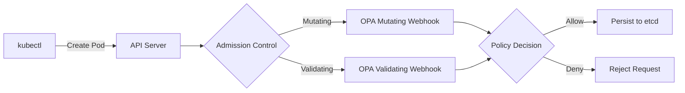

# Kubernetes 集成（Kubernetes Integration）

> **适用版本**: Kubernetes 1.23+ | OPA v0.55+ | Gatekeeper v3.10+  
> **推荐版本**: Kubernetes 1.28+ | OPA v0.68+ | Gatekeeper v3.17+  
> **最后验证**: 2025-10-21  
> **文档状态**: ✅ 生产验证  
> **成熟度**: CNCF毕业项目

---

## ⚠️ 生产部署提示

> **Kubernetes生产环境注意**:
> 
> - ✅ **高可用**: Gatekeeper至少3副本，跨可用区部署
> - ✅ **资源限制**: 根据集群规模设置合理的CPU/内存
> - ✅ **审计模式**: 新策略先用`audit`模式验证，稳定后改为`enforce`
> - ✅ **白名单**: 为系统命名空间（kube-system等）配置例外
> - ✅ **监控告警**: 监控策略违规率、Webhook延迟、错误率
> - ⚠️ Admission Webhook失败会阻塞所有资源创建，务必测试充分
> - ⚠️ 策略更新可能影响现有资源，使用Constraint审计功能评估影响
> 
> 相关: [生产案例-金融K8s策略](../../PRODUCTION_CASES.md#案例2金融公司kubernetes策略) | [检查清单](../../CHECKLIST.md)

---

## 目录

- [Kubernetes 集成（Kubernetes Integration）](#kubernetes-集成kubernetes-integration)
  - [⚠️ 生产部署提示](#️-生产部署提示)
  - [目录](#目录)
  - [1. 集成概述](#1-集成概述)
    - [1.1 为什么需要OPA in Kubernetes](#11-为什么需要opa-in-kubernetes)
    - [1.2 集成点](#12-集成点)
    - [1.3 部署模式对比](#13-部署模式对比)
  - [2. Admission Control集成](#2-admission-control集成)
    - [2.1 架构](#21-架构)
    - [2.2 Validating Admission Webhook](#22-validating-admission-webhook)
      - [2.2.1 部署OPA](#221-部署opa)
      - [2.2.2 配置Webhook](#222-配置webhook)
      - [2.2.3 策略示例](#223-策略示例)
    - [2.3 Mutating Admission Webhook](#23-mutating-admission-webhook)
      - [2.3.1 配置](#231-配置)
      - [2.3.2 策略示例](#232-策略示例)
  - [3. Gatekeeper项目](#3-gatekeeper项目)
    - [3.1 概述](#31-概述)
    - [3.2 核心概念](#32-核心概念)
      - [3.2.1 ConstraintTemplate（约束模板）](#321-constrainttemplate约束模板)
      - [3.2.2 Constraint（约束实例）](#322-constraint约束实例)
    - [3.3 部署Gatekeeper](#33-部署gatekeeper)
      - [3.3.1 安装](#331-安装)
      - [3.3.2 验证安装](#332-验证安装)
    - [3.4 预定义策略库](#34-预定义策略库)
    - [3.5 审计模式](#35-审计模式)
  - [4. 常见应用场景](#4-常见应用场景)
    - [4.1 安全合规](#41-安全合规)
      - [4.1.1 禁止以root运行](#411-禁止以root运行)
      - [4.1.2 强制网络策略](#412-强制网络策略)
    - [4.2 资源治理](#42-资源治理)
      - [4.2.1 CPU/内存限制](#421-cpu内存限制)
      - [4.2.2 副本数限制](#422-副本数限制)
    - [4.3 命名规范](#43-命名规范)
      - [4.3.1 资源命名](#431-资源命名)
      - [4.3.2 标签规范](#432-标签规范)
  - [5. 部署架构](#5-部署架构)
    - [5.1 高可用架构](#51-高可用架构)
    - [5.2 策略分发](#52-策略分发)
      - [5.2.1 Bundle方式](#521-bundle方式)
      - [5.2.2 ConfigMap方式](#522-configmap方式)
      - [5.2.3 OCI方式](#523-oci方式)
  - [6. 最佳实践](#6-最佳实践)
    - [6.1 性能优化](#61-性能优化)
    - [6.2 安全加固](#62-安全加固)
    - [6.3 监控与告警](#63-监控与告警)
  - [附录: 故障排查](#附录-故障排查)
    - [常见问题](#常见问题)

---

## 1. 集成概述

### 1.1 为什么需要OPA in Kubernetes

**痛点**:

- ✗ 原生RBAC表达能力有限
- ✗ 无法跨资源实施策略
- ✗ 缺少细粒度的字段级控制
- ✗ 难以实施组织级合规要求

**OPA解决方案**:

- ✓ 统一策略语言（Rego）
- ✓ 动态准入控制（Admission Control）
- ✓ 运行时策略执行
- ✓ 审计与合规报告

---

### 1.2 集成点



**集成层次**:

1. **Admission Webhook**: 准入控制（主要）
2. **Authorization Webhook**: 授权决策
3. **Audit Webhook**: 审计日志
4. **Sidecar Injector**: 注入策略代理

---

### 1.3 部署模式对比

| 模式 | 架构 | 适用场景 | 成熟度 |
|------|------|---------|--------|
| **OPA Sidecar** | 每Pod一OPA | 应用级策略 | 🟢 生产 |
| **OPA Admission** | 集群级OPA | 准入控制 | 🟢 生产 |
| **Gatekeeper** | CRD+OPA | 合规管理 | 🟢 CNCF毕业 |
| **Kyverno** | 纯K8s原生 | 简单策略 | 🟡 竞品 |

---

## 2. Admission Control集成

### 2.1 架构

**组件**:

```text
┌─────────────────────────────────────────┐
│        Kubernetes API Server            │
└──────┬──────────────────────┬───────────┘
       │ Mutating             │ Validating
       ▼                      ▼
┌─────────────────┐   ┌─────────────────┐
│ OPA Mutating    │   │ OPA Validating  │
│ Webhook         │   │ Webhook         │
│ (修改资源)       │   │ (验证资源)       │
└────────┬────────┘   └────────┬─────────┘
         │                     │
         └──────────┬──────────┘
                    ▼
         ┌─────────────────────┐
         │    OPA Engine       │
         │  ┌───────────────┐  │
         │  │  Rego Policy  │  │
         │  └───────────────┘  │
         └─────────────────────┘
```

---

### 2.2 Validating Admission Webhook

**用途**: 验证资源是否符合策略，拒绝不合规请求。

#### 2.2.1 部署OPA

**Deployment**:

```yaml
apiVersion: apps/v1
kind: Deployment
metadata:
  name: opa
  namespace: opa
spec:
  replicas: 3
  selector:
    matchLabels:
      app: opa
  template:
    metadata:
      labels:
        app: opa
    spec:
      containers:
      - name: opa
        image: openpolicyagent/opa:0.60.0
        args:
          - "run"
          - "--server"
          - "--addr=:8181"
          - "--diagnostic-addr=:8282"
          - "--bundle=/policies"
          - "--log-level=debug"
        ports:
        - containerPort: 8181
          name: https
        - containerPort: 8282
          name: diagnostics
        volumeMounts:
        - name: policies
          mountPath: /policies
        livenessProbe:
          httpGet:
            path: /health
            port: 8282
          initialDelaySeconds: 5
          periodSeconds: 5
        readinessProbe:
          httpGet:
            path: /health?bundle=true
            port: 8282
          initialDelaySeconds: 5
          periodSeconds: 5
      volumes:
      - name: policies
        configMap:
          name: opa-policies
```

**Service**:

```yaml
apiVersion: v1
kind: Service
metadata:
  name: opa
  namespace: opa
spec:
  selector:
    app: opa
  ports:
  - name: https
    port: 443
    targetPort: 8181
```

#### 2.2.2 配置Webhook

**ValidatingWebhookConfiguration**:

```yaml
apiVersion: admissionregistration.k8s.io/v1
kind: ValidatingWebhookConfiguration
metadata:
  name: opa-validating-webhook
webhooks:
- name: validating.opa.io
  clientConfig:
    service:
      name: opa
      namespace: opa
      path: "/v1/data/kubernetes/admission/deny"
    caBundle: <BASE64_CA_CERT>
  rules:
  - operations: ["CREATE", "UPDATE"]
    apiGroups: ["*"]
    apiVersions: ["*"]
    resources: ["pods", "deployments", "services"]
  admissionReviewVersions: ["v1"]
  sideEffects: None
  failurePolicy: Fail  # or Ignore
  namespaceSelector:
    matchExpressions:
    - key: opa-admission
      operator: NotIn
      values: ["ignore"]
```

**关键字段**:

- `failurePolicy`: `Fail`（拒绝）或 `Ignore`（跳过）
- `namespaceSelector`: 排除系统命名空间
- `path`: 策略查询路径

#### 2.2.3 策略示例

**禁止特权容器**:

```rego
package kubernetes.admission

import future.keywords.if
import future.keywords.contains

deny contains msg if {
    input.request.kind.kind == "Pod"
    container := input.request.object.spec.containers[_]
    container.securityContext.privileged == true
    msg := sprintf("Privileged容器被禁止: %v", [container.name])
}
```

**要求资源限制**:

```rego
deny contains msg if {
    input.request.kind.kind == "Pod"
    container := input.request.object.spec.containers[_]
    not container.resources.limits
    msg := sprintf("容器 %v 必须设置资源限制", [container.name])
}
```

**镜像仓库白名单**:

```rego
allowed_registries := [
    "gcr.io",
    "docker.io/library",
    "mycompany.azurecr.io"
]

deny contains msg if {
    input.request.kind.kind == "Pod"
    container := input.request.object.spec.containers[_]
    image := container.image
    not image_from_allowed_registry(image)
    msg := sprintf("镜像 %v 来自未授权仓库", [image])
}

image_from_allowed_registry(image) if {
    some registry in allowed_registries
    startswith(image, registry)
}
```

---

### 2.3 Mutating Admission Webhook

**用途**: 自动修改资源，注入sidecar、标签等。

#### 2.3.1 配置

**MutatingWebhookConfiguration**:

```yaml
apiVersion: admissionregistration.k8s.io/v1
kind: MutatingWebhookConfiguration
metadata:
  name: opa-mutating-webhook
webhooks:
- name: mutating.opa.io
  clientConfig:
    service:
      name: opa
      namespace: opa
      path: "/v1/data/kubernetes/admission/mutate"
    caBundle: <BASE64_CA_CERT>
  rules:
  - operations: ["CREATE"]
    apiGroups: [""]
    apiVersions: ["v1"]
    resources: ["pods"]
  admissionReviewVersions: ["v1"]
  sideEffects: None
  failurePolicy: Fail
```

#### 2.3.2 策略示例

**自动添加标签**:

```rego
package kubernetes.admission

import future.keywords.if

mutate contains patch if {
    input.request.kind.kind == "Pod"
    not input.request.object.metadata.labels.team
    patch := {
        "op": "add",
        "path": "/metadata/labels/team",
        "value": "default"
    }
}
```

**注入Sidecar容器**:

```rego
mutate contains patch if {
    input.request.kind.kind == "Pod"
    input.request.object.metadata.annotations["inject-sidecar"] == "true"
    patch := {
        "op": "add",
        "path": "/spec/containers/-",
        "value": {
            "name": "logging-sidecar",
            "image": "fluentd:v1.14",
            "resources": {
                "limits": {"memory": "100Mi"}
            }
        }
    }
}
```

**返回格式**（JSON Patch RFC 6902）:

```json
{
    "apiVersion": "admission.k8s.io/v1",
    "kind": "AdmissionReview",
    "response": {
        "uid": "<request-uid>",
        "allowed": true,
        "patchType": "JSONPatch",
        "patch": "W3sib3AiOiAiYWRkIiwgInBhdGgiOi..."  // Base64编码
    }
}
```

---

## 3. Gatekeeper项目

### 3.1 概述

**Gatekeeper** = OPA + Kubernetes CRD + 约束框架

**优势**:

- ✓ 原生Kubernetes体验（CRD）
- ✓ 预定义策略库（200+ templates）
- ✓ 审计模式（发现而非阻止）
- ✓ 自动化测试框架

**GitHub**: <https://github.com/open-policy-agent/gatekeeper>

---

### 3.2 核心概念

#### 3.2.1 ConstraintTemplate（约束模板）

**定义**: 可复用的策略模板（Rego + CRD Schema）。

**示例**:

```yaml
apiVersion: templates.gatekeeper.sh/v1
kind: ConstraintTemplate
metadata:
  name: k8srequiredlabels
spec:
  crd:
    spec:
      names:
        kind: K8sRequiredLabels
      validation:
        openAPIV3Schema:
          properties:
            labels:
              type: array
              items:
                type: string
  targets:
  - target: admission.k8s.gatekeeper.sh
    rego: |
      package k8srequiredlabels

      import future.keywords.if

      violation[{"msg": msg, "details": {"missing_labels": missing}}] if {
        provided := {label | input.review.object.metadata.labels[label]}
        required := {label | label := input.parameters.labels[_]}
        missing := required - provided
        count(missing) > 0
        msg := sprintf("缺少必需标签: %v", [missing])
      }
```

**组成**:

- `crd.spec`: CRD定义（参数 schema）
- `targets[].rego`: Rego策略逻辑

#### 3.2.2 Constraint（约束实例）

**定义**: ConstraintTemplate 的实例化，指定参数。

**示例**:

```yaml
apiVersion: constraints.gatekeeper.sh/v1beta1
kind: K8sRequiredLabels
metadata:
  name: pod-must-have-team-label
spec:
  match:
    kinds:
    - apiGroups: [""]
      kinds: ["Pod"]
  parameters:
    labels:
    - "team"
    - "app"
```

---

### 3.3 部署Gatekeeper

#### 3.3.1 安装

**Helm安装**:

```bash
helm repo add gatekeeper https://open-policy-agent.github.io/gatekeeper/charts
helm install gatekeeper/gatekeeper \
    --name-template=gatekeeper \
    --namespace gatekeeper-system \
    --create-namespace
```

**Manifest安装**:

```bash
kubectl apply -f https://raw.githubusercontent.com/open-policy-agent/gatekeeper/release-3.15/deploy/gatekeeper.yaml
```

#### 3.3.2 验证安装

```bash
kubectl get pods -n gatekeeper-system
# 输出:
# NAME                                             READY   STATUS
# gatekeeper-audit-66c8f6f7d9-xxxxx               1/1     Running
# gatekeeper-controller-manager-5d7f96d9b7-xxxxx  1/1     Running
# gatekeeper-controller-manager-5d7f96d9b7-yyyyy  1/1     Running
```

---

### 3.4 预定义策略库

**PSP（Pod Security Policy）替代**:

```yaml
# 禁止特权容器
apiVersion: templates.gatekeeper.sh/v1
kind: ConstraintTemplate
metadata:
  name: k8spsprivilegedcontainer
# ... (200行Rego)
```

**常用模板**:

| 模板 | 用途 |
|------|------|
| `K8sRequiredLabels` | 必需标签 |
| `K8sBlockNodePort` | 禁止NodePort |
| `K8sImageDigests` | 要求镜像摘要 |
| `K8sRequiredResources` | 必需资源限制 |
| `K8sDisallowedTags` | 禁止latest标签 |

**库地址**: <https://github.com/open-policy-agent/gatekeeper-library>

---

### 3.5 审计模式

**Audit Controller**: 定期扫描现有资源，报告违规。

**启用审计**:

```yaml
apiVersion: constraints.gatekeeper.sh/v1beta1
kind: K8sRequiredLabels
metadata:
  name: pod-must-have-team-label
spec:
  enforcementAction: dryrun  # 或 deny/warn
  ...
```

**查看违规**:

```bash
kubectl get k8srequiredlabels pod-must-have-team-label -o yaml
```

**Status字段**:

```yaml
status:
  totalViolations: 5
  violations:
  - enforcementAction: dryrun
    kind: Pod
    message: "缺少必需标签: {team}"
    name: bad-pod
    namespace: default
```

---

## 4. 常见应用场景

### 4.1 安全合规

#### 4.1.1 禁止以root运行

```rego
package security

import future.keywords.if

violation[{"msg": msg}] if {
    not input.review.object.spec.securityContext.runAsNonRoot
    msg := "Pod必须以非root用户运行"
}
```

#### 4.1.2 强制网络策略

```rego
violation[{"msg": msg}] if {
    input.review.kind.kind == "Pod"
    namespace := input.review.namespace
    not has_network_policy(namespace)
    msg := sprintf("命名空间 %v 必须有NetworkPolicy", [namespace])
}

has_network_policy(ns) if {
    some policy in data.kubernetes.networkpolicies
    policy.metadata.namespace == ns
}
```

---

### 4.2 资源治理

#### 4.2.1 CPU/内存限制

```rego
violation[{"msg": msg}] if {
    container := input.review.object.spec.containers[_]
    not container.resources.limits.memory
    msg := sprintf("容器 %v 必须设置内存限制", [container.name])
}

violation[{"msg": msg}] if {
    container := input.review.object.spec.containers[_]
    memory_limit := container.resources.limits.memory
    memory_limit_bytes := parse_quantity(memory_limit)
    memory_limit_bytes > 2 * 1024 * 1024 * 1024  # 2Gi
    msg := sprintf("容器 %v 内存限制不能超过2Gi", [container.name])
}
```

#### 4.2.2 副本数限制

```rego
violation[{"msg": msg}] if {
    input.review.kind.kind == "Deployment"
    replicas := input.review.object.spec.replicas
    replicas > 10
    msg := sprintf("Deployment副本数不能超过10，当前为 %v", [replicas])
}
```

---

### 4.3 命名规范

#### 4.3.1 资源命名

```rego
violation[{"msg": msg}] if {
    name := input.review.object.metadata.name
    not re_match("^[a-z0-9]([-a-z0-9]*[a-z0-9])?$", name)
    msg := sprintf("资源名 %v 不符合命名规范", [name])
}
```

#### 4.3.2 标签规范

```rego
required_labels := ["app", "team", "env"]

violation[{"msg": msg}] if {
    labels := input.review.object.metadata.labels
    some required_label in required_labels
    not labels[required_label]
    msg := sprintf("缺少必需标签: %v", [required_label])
}
```

---

## 5. 部署架构

### 5.1 高可用架构

```text
┌─────────────────────────────────────────────┐
│          Kubernetes API Server (HA)         │
└──────────────────┬──────────────────────────┘
                   │
        ┌──────────┴──────────┐
        │  LoadBalancer       │
        └──────────┬──────────┘
                   │
     ┌─────────────┼─────────────┐
     │             │             │
┌────▼────┐   ┌───▼────┐   ┌───▼────┐
│ OPA-1   │   │ OPA-2  │   │ OPA-3  │
│ Pod     │   │ Pod    │   │ Pod    │
└─────────┘   └────────┘   └────────┘
     │             │             │
     └─────────────┼─────────────┘
                   │
           ┌───────▼────────┐
           │  Bundle Server │
           │  (S3/OCI/Git)  │
           └────────────────┘
```

**配置**:

```yaml
spec:
  replicas: 3
  affinity:
    podAntiAffinity:
      requiredDuringSchedulingIgnoredDuringExecution:
      - labelSelector:
          matchExpressions:
          - key: app
            operator: In
            values:
            - opa
        topologyKey: kubernetes.io/hostname
```

---

### 5.2 策略分发

#### 5.2.1 Bundle方式

**Bundle Server**:

```yaml
services:
  - name: bundle-server
    url: https://bundle.example.com
bundles:
  authz:
    service: bundle-server
    resource: bundles/kubernetes.tar.gz
    polling:
      min_delay_seconds: 10
      max_delay_seconds: 30
```

#### 5.2.2 ConfigMap方式

```bash
kubectl create configmap opa-policies \
    --from-file=policy.rego \
    --namespace=opa
```

#### 5.2.3 OCI方式

```yaml
bundles:
  authz:
    resource: ghcr.io/myorg/opa-policies:latest
    persist: true
```

---

## 6. 最佳实践

### 6.1 性能优化

**1. 使用namespaceSelector减少调用**:

```yaml
namespaceSelector:
  matchExpressions:
  - key: policy-enabled
    operator: In
    values: ["true"]
```

**2. 合理设置failurePolicy**:

```yaml
failurePolicy: Ignore  # 生产环境建议 Fail
```

**3. 启用缓存**:

```yaml
args:
  - "--decision-logs-reporting-timeout=10s"
  - "--decision-logs-reporting-interval=5s"
```

---

### 6.2 安全加固

**1. 启用TLS**:

```bash
# 生成证书
openssl req -x509 -newkey rsa:4096 -keyout key.pem -out cert.pem -days 365 -nodes

# 创建Secret
kubectl create secret tls opa-tls \
    --cert=cert.pem \
    --key=key.pem \
    --namespace=opa
```

**2. RBAC最小权限**:

```yaml
apiVersion: rbac.authorization.k8s.io/v1
kind: ClusterRole
metadata:
  name: opa
rules:
- apiGroups: ["*"]
  resources: ["*"]
  verbs: ["get", "list", "watch"]  # 只读
```

---

### 6.3 监控与告警

**Prometheus指标**:

```yaml
apiVersion: v1
kind: Service
metadata:
  name: opa-metrics
  annotations:
    prometheus.io/scrape: "true"
    prometheus.io/port: "8282"
spec:
  selector:
    app: opa
  ports:
  - port: 8282
    name: metrics
```

**关键指标**:

- `http_request_duration_seconds`: Webhook延迟
- `opa_policy_evaluation_total`: 策略求值次数
- `admission_webhook_request_total`: Webhook请求总数

**告警规则**:

```yaml
- alert: OPAWebhookHighLatency
  expr: histogram_quantile(0.99, http_request_duration_seconds_bucket{handler="webhook"}) > 0.1
  for: 5m
  annotations:
    summary: "OPA Webhook延迟超过100ms"
```

---

## 附录: 故障排查

### 常见问题

**1. Webhook超时**:

```bash
# 检查OPA日志
kubectl logs -n opa -l app=opa --tail=100

# 检查网络连通性
kubectl run test --image=busybox --rm -it -- wget -O- http://opa.opa.svc:8181/health
```

**2. 策略不生效**:

```bash
# 检查策略是否加载
curl http://localhost:8181/v1/policies

# 测试策略
opa eval --bundle /policies 'data.kubernetes.admission.deny' -i input.json
```

**3. 证书问题**:

```bash
# 验证证书
openssl x509 -in cert.pem -text -noout

# 重新生成CA Bundle
kubectl get secret opa-tls -n opa -o jsonpath='{.data.ca\.crt}' | base64 -d
```

---

**下一篇**: [04.2-Gatekeeper详解](./04.2-Gatekeeper详解.md)  
**相关**: [05.3-合规性检查](../05-应用场景/05.3-合规性检查.md)
