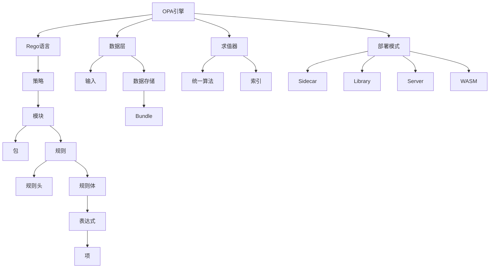

# OPA 核心概念定义（Core Concepts & Definitions）

> **适用版本**: OPA v0.10+ (核心概念稳定) | 推荐 v0.68+  
> **Rego版本**: v1.0  
> **目标读者**: 初学者 → 高级用户  
> **最后验证**: 2025-10-21  
> **文档状态**: ✅ 已验证

---

## 📘 概念图谱指南

> **本文档用途**:
>
> - ✅ 快速查找OPA/Rego核心术语定义
> - ✅ 理解概念之间的关系
> - ✅ 作为学习路径的参考手册
> - ✅ 解决术语混淆问题
>
> **使用建议**:
>
> - 初学者：按顺序阅读，建立完整概念体系
> - 进阶用户：作为术语速查手册
> - 配合[术语表](../GLOSSARY.md)和[快速参考](../QUICK_REFERENCE.md)使用
>
> 相关: [学习路线图](../LEARNING_PATH.md) | [FAQ](../FAQ.md)

---

## 目录

- [OPA 核心概念定义（Core Concepts \& Definitions）](#opa-核心概念定义core-concepts--definitions)
  - [📘 概念图谱指南](#-概念图谱指南)
  - [目录](#目录)
  - [1. 基础概念层](#1-基础概念层)
    - [1.1 OPA (Open Policy Agent)](#11-opa-open-policy-agent)
    - [1.2 Rego (策略语言)](#12-rego-策略语言)
    - [1.3 Policy (策略)](#13-policy-策略)
    - [1.4 Rule (规则)](#14-rule-规则)
      - [1.4.1 完全规则（Complete Rule）](#141-完全规则complete-rule)
      - [1.4.2 部分规则（Partial Rule）](#142-部分规则partial-rule)
      - [1.4.3 多值规则（Multi-Value Rule）](#143-多值规则multi-value-rule)
    - [1.5 Query (查询)](#15-query-查询)
  - [2. 策略概念层](#2-策略概念层)
    - [2.1 Module (模块)](#21-module-模块)
    - [2.2 Package (包)](#22-package-包)
    - [2.3 Expression (表达式)](#23-expression-表达式)
      - [2.3.1 统一表达式（Unification）](#231-统一表达式unification)
      - [2.3.2 赋值表达式（Assignment）](#232-赋值表达式assignment)
      - [2.3.3 比较表达式（Comparison）](#233-比较表达式comparison)
      - [2.3.4 成员表达式（Membership）](#234-成员表达式membership)
      - [2.3.5 否定表达式（Negation）](#235-否定表达式negation)
    - [2.4 Term (项)](#24-term-项)
    - [2.5 Comprehension (推导式)](#25-comprehension-推导式)
      - [2.5.1 数组推导](#251-数组推导)
      - [2.5.2 集合推导](#252-集合推导)
      - [2.5.3 对象推导](#253-对象推导)
  - [3. 数据概念层](#3-数据概念层)
    - [3.1 Input (输入)](#31-input-输入)
    - [3.2 Data (数据)](#32-data-数据)
    - [3.3 Bundle (策略包)](#33-bundle-策略包)
    - [3.4 Document (文档)](#34-document-文档)
  - [4. 执行概念层](#4-执行概念层)
    - [4.1 Evaluation (求值)](#41-evaluation-求值)
    - [4.2 Unification (统一)](#42-unification-统一)
    - [4.3 Backtracking (回溯)](#43-backtracking-回溯)
    - [4.4 Partial Evaluation (部分求值)](#44-partial-evaluation-部分求值)
    - [4.5 Indexing (索引)](#45-indexing-索引)
      - [4.5.1 数据索引](#451-数据索引)
      - [4.5.2 规则索引](#452-规则索引)
  - [5. 部署概念层](#5-部署概念层)
    - [5.1 Sidecar (边车模式)](#51-sidecar-边车模式)
    - [5.2 Library (库嵌入)](#52-library-库嵌入)
    - [5.3 Server (服务模式)](#53-server-服务模式)
    - [5.4 WASM (WebAssembly)](#54-wasm-webassembly)
  - [6. 概念关系网络](#6-概念关系网络)
    - [6.1 概念依赖图](#61-概念依赖图)
    - [6.2 概念交互矩阵](#62-概念交互矩阵)
    - [6.3 抽象层次](#63-抽象层次)
  - [附录：术语对照表](#附录术语对照表)

---

## 1. 基础概念层

### 1.1 OPA (Open Policy Agent)

**定义**: 开源的、通用的、云原生的策略引擎。

**核心特征**:

```text
OPA = {
    语言: Rego (声明式策略语言),
    引擎: Top-Down求值器,
    数据: JSON格式,
    部署: Sidecar | Library | Server | WASM,
    协议: REST | gRPC,
    生态: CNCF毕业项目
}
```

**设计哲学**:

- **Policy as Code**: 策略即代码，版本化、测试、CI/CD
- **Decoupled Decision**: 决策逻辑与业务逻辑解耦
- **General Purpose**: 领域无关，适用于任何需要决策的场景

**类比**:

```text
OPA : 决策 ≈ PostgreSQL : 数据存储
```

---

### 1.2 Rego (策略语言)

**定义**: OPA的策略定义语言，基于Datalog的声明式查询语言。

**语言特性**:

| 特性 | 描述 | 示例 |
|------|------|------|
| **声明式** | 描述"什么"而非"如何" | `allow if input.user == "admin"` |
| **逻辑式** | 基于一阶逻辑 | `p :- q, r, s` |
| **无副作用** | 纯函数式 | 无全局状态修改 |
| **数据驱动** | 数据与策略分离 | `data.users` vs `input.request` |
| **可组合** | 规则相互引用 | `allow if is_admin` |

**命名由来**: **Re**asoning **Go** → Rego

**类型系统**:

```text
动态强类型 + 结构化类型 + 无隐式转换
```

---

### 1.3 Policy (策略)

**定义**: 用Rego编写的决策逻辑集合，描述"允许什么"或"拒绝什么"。

**策略结构**:

```rego
# 包命名空间
package authz.api.v1

# 导入依赖
import data.roles

# 规则定义
allow if {
    input.method == "GET"
    is_public_resource
}

# 辅助规则
is_public_resource if {
    startswith(input.path, "/public")
}
```

**策略类型**:

```text
策略分类
├── 访问控制策略 (Authorization)
├── 合规性策略 (Compliance)
├── 资源配置策略 (Configuration)
└── 数据过滤策略 (Data Filtering)
```

**策略生命周期**:

```text
编写 → 测试 → 版本控制 → 打包(Bundle) → 分发 → 加载 → 执行 → 监控
```

---

### 1.4 Rule (规则)

**定义**: 策略的基本单元，由**规则头**（head）和**规则体**（body）组成。

**形式化定义**:

```text
Rule ::= Head :- Body
```

**规则类型**:

#### 1.4.1 完全规则（Complete Rule）

```rego
# 返回单一值
is_admin := true if {
    input.user.role == "admin"
}
```

#### 1.4.2 部分规则（Partial Rule）

```rego
# 生成集合
admins contains user.name if {
    user := data.users[_]
    user.role == "admin"
}

# 生成对象
user_scores[user] := score if {
    score := calculate_score(user)
}
```

#### 1.4.3 多值规则（Multi-Value Rule）

```rego
# 多个定义（OR语义）
allow if { input.user == "admin" }
allow if { input.path == "/public" }
```

**规则求值**:

```text
条件全部满足 → 规则成功 → 生成值
任一条件失败 → 规则失败 → undefined
```

---

### 1.5 Query (查询)

**定义**: 向OPA发起的决策请求，由输入数据和查询路径组成。

**查询格式**:

```http
POST /v1/data/authz/allow
Content-Type: application/json

{
    "input": {
        "user": "alice",
        "method": "GET",
        "path": "/api/users"
    }
}
```

**响应格式**:

```json
{
    "result": true,
    "decision_id": "uuid-1234"
}
```

**查询类型**:

| 类型 | 路径 | 返回 |
|------|------|------|
| **策略查询** | `/v1/data/pkg/rule` | 规则结果 |
| **数据查询** | `/v1/data/users/alice` | 数据内容 |
| **部分求值** | `/v1/compile` | 优化后的查询 |

---

## 2. 策略概念层

### 2.1 Module (模块)

**定义**: 包含一组规则的Rego源文件（`.rego`）。

**模块结构**:

```rego
# 1. Package声明（必需）
package example.rbac

# 2. Imports（可选）
import data.users
import future.keywords.if

# 3. Rules（核心）
allow if {
    # 规则逻辑
}
```

**模块命名**:

```text
文件路径 → 包路径
policy/
  authz/
    api.rego  → package policy.authz.api
```

---

### 2.2 Package (包)

**定义**: 策略的命名空间，组织相关规则。

**包层次**:

```text
data
├── kubernetes
│   ├── admission     # package kubernetes.admission
│   │   ├── pods
│   │   └── services
│   └── rbac          # package kubernetes.rbac
└── api
    └── authz         # package api.authz
```

**包引用**:

```rego
# 定义包
package api.authz

# 引用其他包
import data.kubernetes.rbac

allow if {
    rbac.can_access(input.user, input.resource)
}
```

---

### 2.3 Expression (表达式)

**定义**: 规则体的组成部分，表示约束或计算。

**表达式类型**:

#### 2.3.1 统一表达式（Unification）

```rego
x = 5                      # 绑定变量
[a, b] = [1, 2]           # 模式匹配
```

#### 2.3.2 赋值表达式（Assignment）

```rego
x := 5                     # 局部赋值
y := x * 2                # 计算
```

#### 2.3.3 比较表达式（Comparison）

```rego
input.count > 10          # 大于
input.name == "alice"     # 相等
```

#### 2.3.4 成员表达式（Membership）

```rego
import future.keywords.in

"admin" in input.roles    # 成员检查
```

#### 2.3.5 否定表达式（Negation）

```rego
not is_blacklisted        # 逻辑否定
```

---

### 2.4 Term (项)

**定义**: 表达式的基本单元，可以是值、变量或引用。

**项分类**:

```text
Term
├── Scalar (标量)
│   ├── Boolean: true, false
│   ├── Number: 42, 3.14
│   ├── String: "hello"
│   └── Null: null
├── Composite (复合)
│   ├── Array: [1, 2, 3]
│   ├── Object: {"key": "value"}
│   └── Set: {1, 2, 3}
├── Variable (变量)
│   └── x, user, count
└── Reference (引用)
    └── input.user.name, data.users[i]
```

---

### 2.5 Comprehension (推导式)

**定义**: 从集合生成新集合的表达式。

**推导式类型**:

#### 2.5.1 数组推导

```rego
admin_names := [u.name | u := data.users[_]; u.role == "admin"]
```

**语义**:

```text
[表达式 | 绑定; 条件1; 条件2; ...]
```

#### 2.5.2 集合推导

```rego
admin_set := {u.name | u := data.users[_]; u.role == "admin"}
```

#### 2.5.3 对象推导

```rego
user_map := {u.id: u | u := data.users[_]}
```

**执行流程**:

```text
遍历集合 → 应用条件过滤 → 收集表达式结果 → 返回新集合
```

---

## 3. 数据概念层

### 3.1 Input (输入)

**定义**: 查询时提供的上下文数据，通常是请求信息。

**输入结构**:

```json
{
    "input": {
        "user": "alice",
        "method": "GET",
        "path": "/api/users",
        "headers": {
            "Authorization": "Bearer ..."
        },
        "timestamp": "2025-10-20T12:00:00Z"
    }
}
```

**访问方式**:

```rego
# 直接访问
user := input.user
method := input.method

# 条件检查
allow if {
    input.method == "GET"
    input.user in data.admins
}
```

**输入特性**:

- 每次查询可不同
- 不可修改（只读）
- 通常来自应用层

---

### 3.2 Data (数据)

**定义**: 存储在OPA中的静态或动态数据，供策略引用。

**数据来源**:

```text
Data Sources
├── Bundle (打包数据)
│   └── data.json
├── Remote (远程拉取)
│   ├── HTTP/HTTPS
│   ├── S3
│   └── Git
├── API (动态加载)
│   └── PUT /v1/data/...
└── Config (启动配置)
    └── --bundle, --data
```

**数据结构示例**:

```json
{
    "users": {
        "alice": {
            "role": "admin",
            "department": "engineering"
        },
        "bob": {
            "role": "user",
            "department": "sales"
        }
    },
    "roles": {
        "admin": {
            "permissions": ["read", "write", "delete"]
        },
        "user": {
            "permissions": ["read"]
        }
    }
}
```

**访问方式**:

```rego
# 完整路径
alice := data.users.alice

# 模式匹配
user := data.users[name]  # name绑定到键

# 遍历
users := [u | u := data.users[_]]
```

---

### 3.3 Bundle (策略包)

**定义**: 包含策略文件和数据的压缩包（`.tar.gz`），用于分发和部署。

**Bundle结构**:

```text
my-bundle.tar.gz
├── .manifest
├── policy/
│   ├── authz.rego
│   └── rbac.rego
└── data/
    ├── users.json
    └── roles.json
```

**Manifest文件**（`.manifest`）:

```json
{
    "revision": "v1.2.3",
    "roots": ["policy", "data"],
    "metadata": {
        "author": "alice",
        "created": "2025-10-20T12:00:00Z"
    }
}
```

**Bundle加载**:

```bash
# CLI加载
opa run --bundle bundle.tar.gz

# 远程加载
opa run --server \
    --set bundles.authz.service=my-service \
    --set bundles.authz.resource=bundles/authz.tar.gz
```

---

### 3.4 Document (文档)

**定义**: OPA内部数据的层次结构表示，本质上是JSON对象/数组。

**文档路径**:

```text
data                         # 根文档
  ├── users                  # data.users
  │   └── alice              # data.users.alice
  │       └── role           # data.users.alice.role
  └── policies
      └── allow              # data.policies.allow
```

**虚拟文档**:

```rego
# 定义规则
package virtual

result := 42 if {
    input.flag == true
}
```

**访问**:

```text
GET /v1/data/virtual/result?input={"flag":true}
→ {"result": 42}
```

---

## 4. 执行概念层

### 4.1 Evaluation (求值)

**定义**: OPA执行策略查询的过程，计算规则是否满足。

**求值策略**:

```text
Top-Down + Depth-First + Backtracking
```

**求值过程**:

```text
1. 解析查询路径 (data.pkg.rule)
2. 查找对应规则
3. 绑定变量
4. 求值规则体表达式（AND连接）
5. 统一/匹配
6. 返回结果或回溯
```

**求值示例**:

```rego
# 策略
allow if {
    input.method == "GET"    # 步骤1
    is_admin                 # 步骤2
}

is_admin if {
    input.user.role == "admin"  # 步骤2.1
}
```

**求值树**:

```text
allow
  ├─ input.method == "GET" ✓
  └─ is_admin
       └─ input.user.role == "admin" ✓
结果: allow = true
```

---

### 4.2 Unification (统一)

**定义**: 双向模式匹配，使两个项相等的变量绑定过程。

**统一规则**:

```text
unify(v, v) = ∅                    # 相同值
unify(X, t) = {X ↦ t}              # 变量绑定
unify([a, b], [1, 2]) = {a↦1, b↦2} # 结构匹配
```

**示例**:

```rego
# 统一变量
x = 5                 # x 绑定到 5

# 统一数组
[a, b, c] = [1, 2, 3] # a=1, b=2, c=3

# 统一对象
{"name": n, "age": a} = {"name": "alice", "age": 30}
# n="alice", a=30
```

---

### 4.3 Backtracking (回溯)

**定义**: 当求值失败时，返回上一选择点尝试其他可能。

**回溯场景**:

```rego
# 多个规则定义
allow if { condition1 }  # 尝试1
allow if { condition2 }  # 尝试2（如果1失败）

# 集合遍历
user := data.users[_]    # 遍历所有用户
user.role == "admin"     # 回溯到符合条件的
```

**执行流**:

```text
尝试规则1 → 失败 → 回溯 → 尝试规则2 → 成功 → 返回
```

---

### 4.4 Partial Evaluation (部分求值)

**定义**: 预先计算已知数据部分，生成优化后的查询。

**场景**: 数据固定、输入可变。

**示例**:

```rego
# 原始规则
allow if {
    data.roles[input.user].permissions[_] == input.action
}
```

**部分求值后**（假设 `data.roles` 已知）:

```rego
# 针对用户 alice
allow if {
    input.user == "alice"
    {"read", "write"}[_] == input.action
}
```

**性能提升**: `O(n)` → `O(1)`

---

### 4.5 Indexing (索引)

**定义**: 对数据或规则建立索引，加速查询。

**索引类型**:

#### 4.5.1 数据索引

```rego
# 无索引: O(n) 遍历
user := data.users[_]
user.id == input.user_id

# 有索引: O(1) 查找
user := data.users[input.user_id]
```

#### 4.5.2 规则索引

```rego
# OPA自动为以下模式建立索引:
input.x == constant
data.y[z] == constant
```

**性能影响**:

```text
百万条规则 × 索引 = 亚毫秒查询
```

---

## 5. 部署概念层

### 5.1 Sidecar (边车模式)

**定义**: OPA作为独立进程，与应用容器共享Pod/VM。

**架构**:

```text
┌─────────────────┐
│   Kubernetes    │
│      Pod        │
│  ┌───────────┐  │
│  │    App    │  │ ←─ 业务逻辑
│  └─────┬─────┘  │
│        │ REST   │
│  ┌─────▼─────┐  │
│  │    OPA    │  │ ←─ 策略决策
│  └───────────┘  │
└─────────────────┘
```

**优点**:

- ✅ 低延迟（< 1ms）
- ✅ 网络隔离
- ✅ 独立扩展

**适用场景**: 微服务、K8s环境

---

### 5.2 Library (库嵌入)

**定义**: 将OPA作为Go库嵌入应用进程。

**集成方式**:

```go
import "github.com/open-policy-agent/opa/rego"

// 创建查询
query := rego.New(
    rego.Query("data.authz.allow"),
    rego.Input(inputData),
)

// 执行
rs, err := query.Eval(ctx)
if rs.Allowed() {
    // 允许访问
}
```

**优点**:

- ✅ 零网络开销
- ✅ 进程内调用
- ✅ 类型安全

**适用场景**: Go应用、高性能需求

---

### 5.3 Server (服务模式)

**定义**: OPA作为独立HTTP/gRPC服务运行。

**部署**:

```bash
opa run --server \
    --addr :8181 \
    --bundle my-bundle.tar.gz
```

**API**:

```text
POST /v1/data/{path}      # 策略查询
PUT  /v1/policies/{id}    # 上传策略
GET  /v1/data/{path}      # 数据查询
GET  /health              # 健康检查
```

**适用场景**: 多应用共享、集中管理

---

### 5.4 WASM (WebAssembly)

**定义**: 将Rego策略编译为WASM，在沙箱环境执行。

**编译**:

```bash
opa build -t wasm -e 'data.authz.allow' policy.rego
```

**生成**:

```text
policy.wasm        # WASM字节码
policy.tar.gz      # 包含数据
```

**执行**:

```javascript
// 浏览器/边缘环境
const policy = await loadPolicy('policy.wasm');
const result = policy.evaluate(input);
```

**优点**:

- ✅ 轻量（< 200KB）
- ✅ 沙箱安全
- ✅ 跨平台

**适用场景**: 边缘计算、浏览器、CDN

---

## 6. 概念关系网络

### 6.1 概念依赖图



### 6.2 概念交互矩阵

|  | Policy | Rule | Input | Data | Query | Decision |
|---|---|---|---|---|---|---|
| **Policy** | - | 包含 | 读取 | 引用 | 被查询 | 产生 |
| **Rule** | 属于 | - | 读取 | 引用 | 被求值 | 产生 |
| **Input** | 提供给 | 提供给 | - | 独立 | 携带 | 影响 |
| **Data** | 提供给 | 提供给 | 独立 | - | 携带 | 影响 |
| **Query** | 调用 | 调用 | 携带 | 携带 | - | 产生 |
| **Decision** | 来自 | 来自 | 基于 | 基于 | 响应 | - |

### 6.3 抽象层次

```text
第5层：应用层
  ├── 微服务授权
  ├── K8s准入控制
  └── API网关
      ↓
第4层：接口层
  ├── REST API
  ├── gRPC
  └── SDK
      ↓
第3层：策略层
  ├── Policy
  ├── Rule
  └── Expression
      ↓
第2层：语言层
  ├── Rego语法
  ├── 类型系统
  └── 求值语义
      ↓
第1层：引擎层
  ├── 编译器
  ├── 求值器
  └── 存储
      ↓
第0层：基础设施层
  ├── Go Runtime
  ├── WASM Runtime
  └── 操作系统
```

---

## 附录：术语对照表

| 英文 | 中文 | 简要说明 |
|------|------|---------|
| Policy | 策略 | 决策逻辑集合 |
| Rule | 规则 | 策略的基本单元 |
| Query | 查询 | 决策请求 |
| Evaluation | 求值 | 执行策略的过程 |
| Unification | 统一 | 模式匹配算法 |
| Bundle | 策略包 | 打包的策略和数据 |
| Sidecar | 边车 | 进程级部署模式 |
| Partial Evaluation | 部分求值 | 预计算优化技术 |
| Comprehension | 推导式 | 集合生成表达式 |
| Datalog | 数据逻辑 | 逻辑编程语言 |

---

**下一篇**: [07.2-关系矩阵](./07.2-关系矩阵.md)  
**相关**: [02.1-Rego语法规范](../02-语言模型/02.1-Rego语法规范.md)
