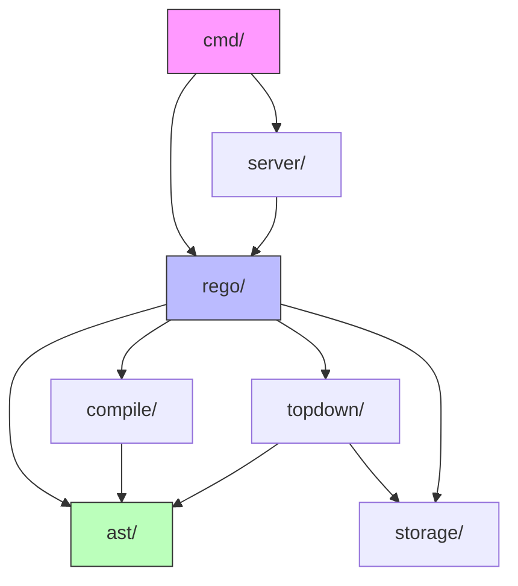

# OPA架构总览与代码结构

> **文档类型**: 源码架构分析  
> **实现语言**: Go 1.20+  
> **适用读者**: 源码贡献者、深度学习者、架构师  
> **先修知识**: Go语言基础、[Rego语法](../02-语言模型/02.1-Rego语法规范.md)  
> **最后更新**: 2025年10月23日  
> **文档状态**: ✅ Phase 2.1 - 架构分析  
> **OPA版本**: v0.68.0

---

## 🏗️ 架构分析说明

> **本文档目标**:
>
> - ✅ 全面理解OPA项目的代码组织结构
> - ✅ 掌握核心模块的职责和依赖关系
> - ✅ 了解从策略到决策的完整代码路径
> - ✅ 为深入源码阅读提供地图和指南
>
> **学习路线**:
>
> 1. **架构总览** → 理解整体设计
> 2. **包结构分析** → 了解模块职责
> 3. **执行流程** → 跟踪代码路径
> 4. **关键接口** → 掌握扩展点
>
> **实际价值**:
>
> - 参与OPA社区贡献
> - 定制扩展OPA功能
> - 深度性能优化
> - 故障诊断和调试

---

## 目录

- [OPA架构总览与代码结构](#opa架构总览与代码结构)
  - [🏗️ 架构分析说明](#️-架构分析说明)
  - [目录](#目录)
  - [1. 项目概览](#1-项目概览)
    - [1.1 项目结构](#11-项目结构)
    - [1.2 代码统计](#12-代码统计)
    - [1.3 技术栈](#13-技术栈)
  - [2. 架构设计](#2-架构设计)
    - [2.1 分层架构](#21-分层架构)
    - [2.2 核心组件](#22-核心组件)
    - [2.3 数据流](#23-数据流)
  - [3. 包结构分析](#3-包结构分析)
    - [3.1 核心包 (core packages)](#31-核心包-core-packages)
      - [`ast/` - AST定义与操作](#ast---ast定义与操作)
      - [`rego/` - 高层API](#rego---高层api)
    - [3.2 编译器包 (compiler packages)](#32-编译器包-compiler-packages)
      - [`compile/` - 编译器](#compile---编译器)
      - [`internal/ir/` - 中间表示](#internalir---中间表示)
    - [3.3 运行时包 (runtime packages)](#33-运行时包-runtime-packages)
      - [`topdown/` - Top-Down求值器](#topdown---top-down求值器)
      - [`storage/` - 存储抽象层](#storage---存储抽象层)
    - [3.4 工具包 (utility packages)](#34-工具包-utility-packages)
      - [`util/` - 工具函数](#util---工具函数)
      - [`metrics/` - 性能指标](#metrics---性能指标)
  - [4. 关键模块详解](#4-关键模块详解)
    - [4.1 AST模块 (`ast/`)](#41-ast模块-ast)
    - [4.2 编译器模块 (`compile/`)](#42-编译器模块-compile)
    - [4.3 求值器模块 (`topdown/`)](#43-求值器模块-topdown)
    - [4.4 存储模块 (`storage/`)](#44-存储模块-storage)
  - [5. 执行流程分析](#5-执行流程分析)
    - [5.1 CLI命令执行](#51-cli命令执行)
    - [5.2 Server请求处理](#52-server请求处理)
    - [5.3 策略求值流程](#53-策略求值流程)
  - [6. 关键接口与扩展点](#6-关键接口与扩展点)
    - [6.1 Storage接口](#61-storage接口)
    - [6.2 Built-in函数接口](#62-built-in函数接口)
    - [6.3 Compiler接口](#63-compiler接口)
  - [7. 依赖关系图](#7-依赖关系图)
    - [7.1 包依赖](#71-包依赖)
    - [7.2 模块交互](#72-模块交互)
  - [8. 构建与部署](#8-构建与部署)
    - [8.1 构建系统](#81-构建系统)
    - [8.2 WASM编译](#82-wasm编译)
    - [8.3 容器化](#83-容器化)
  - [附录](#附录)
    - [A. 重要文件速查](#a-重要文件速查)
    - [B. 调试技巧](#b-调试技巧)
    - [C. 贡献指南](#c-贡献指南)

---

## 1. 项目概览

### 1.1 项目结构

OPA项目采用标准的Go项目布局：

```text
open-policy-agent/opa/
├── ast/                # AST定义与操作
├── bundle/             # Bundle格式与加载
├── cmd/                # CLI命令实现
├── compile/            # 编译器（Rego → IR）
├── cover/              # 代码覆盖率
├── dependencies/       # 依赖分析
├── docs/               # 文档
├── download/           # Bundle下载
├── format/             # 代码格式化
├── hooks/              # 钩子机制
├── internal/           # 内部实现
│   ├── compiler/       # 编译器内部
│   ├── gqlparser/      # GraphQL解析
│   ├── ir/             # 中间表示
│   ├── planner/        # 查询规划
│   └── wasm/           # WASM后端
├── loader/             # 策略加载
├── metrics/            # 性能指标
├── plugins/            # 插件系统
│   ├── bundle/         # Bundle插件
│   ├── discovery/      # 发现插件
│   ├── logs/           # 日志插件
│   └── status/         # 状态插件
├── rego/               # Rego API
├── server/             # HTTP Server
├── storage/            # 存储抽象层
│   └── inmem/          # 内存存储实现
├── test/               # 测试框架
├── topdown/            # Top-Down求值器
│   ├── builtins/       # 内置函数实现
│   ├── cache/          # 求值缓存
│   └── copypropagation/ # 拷贝传播优化
├── tester/             # 测试运行器
├── util/               # 工具函数
├── version/            # 版本信息
├── main.go             # 程序入口
└── Makefile            # 构建脚本
```

### 1.2 代码统计

**核心统计** (OPA v0.68.0):

| 指标 | 数量 | 说明 |
|------|------|------|
| **总代码行数** | ~180K | 包括测试 |
| **Go文件数** | ~900 | 不包括vendor |
| **核心包数** | ~50 | 主要功能包 |
| **内置函数** | 150+ | topdown/builtins |
| **测试覆盖率** | 85%+ | 高质量保证 |

**代码分布**:

```text
topdown/         ~35K 行  (求值器 + 内置函数)
ast/             ~25K 行  (AST定义 + 操作)
compile/         ~15K 行  (编译器)
storage/         ~10K 行  (存储层)
server/          ~8K 行   (HTTP Server)
rego/            ~6K 行   (高层API)
internal/        ~30K 行  (内部实现)
其他             ~50K 行  (CLI, 工具, 插件等)
```

### 1.3 技术栈

**核心技术**:

| 技术 | 用途 | 版本要求 |
|------|------|---------|
| **Go** | 主要实现语言 | 1.20+ |
| **ANTLR** | 语法解析（历史） | - |
| **手写Parser** | 当前Rego解析器 | - |
| **WASM** | 策略编译目标 | - |
| **Protocol Buffers** | Bundle格式 | v3 |

**依赖库**:

```go
// 主要依赖
github.com/ghodss/yaml           // YAML解析
github.com/gorilla/mux           // HTTP路由
github.com/prometheus/client_go  // Metrics
github.com/sirupsen/logrus       // 日志
```

---

## 2. 架构设计

### 2.1 分层架构

OPA采用经典的分层架构：

```text
┌─────────────────────────────────────────────────┐
│             应用层 (Application)                │
│  ┌──────────┐  ┌──────────┐  ┌──────────┐     │
│  │   CLI    │  │  Server  │  │   SDK    │     │
│  └──────────┘  └──────────┘  └──────────┘     │
└─────────────────────────────────────────────────┘
                      ↓
┌─────────────────────────────────────────────────┐
│              API层 (High-Level API)             │
│  ┌──────────────────────────────────────────┐  │
│  │         rego.Rego (统一查询接口)         │  │
│  └──────────────────────────────────────────┘  │
└─────────────────────────────────────────────────┘
                      ↓
┌─────────────────────────────────────────────────┐
│            编译层 (Compilation)                 │
│  ┌──────────┐  ┌──────────┐  ┌──────────┐     │
│  │  Parser  │→ │ Compiler │→ │   IR     │     │
│  └──────────┘  └──────────┘  └──────────┘     │
└─────────────────────────────────────────────────┘
                      ↓
┌─────────────────────────────────────────────────┐
│            求值层 (Evaluation)                  │
│  ┌──────────────────────────────────────────┐  │
│  │    TopDown Evaluator (求值引擎)          │  │
│  │  ┌────────┐  ┌────────┐  ┌────────┐     │  │
│  │  │Builtins│  │Indexing│  │ Cache  │     │  │
│  │  └────────┘  └────────┘  └────────┘     │  │
│  └──────────────────────────────────────────┘  │
└─────────────────────────────────────────────────┘
                      ↓
┌─────────────────────────────────────────────────┐
│            存储层 (Storage)                     │
│  ┌──────────────────────────────────────────┐  │
│  │  Storage Interface (抽象存储接口)        │  │
│  │  ┌──────────┐  ┌──────────┐             │  │
│  │  │  InMem   │  │  Custom  │             │  │
│  │  └──────────┘  └──────────┘             │  │
│  └──────────────────────────────────────────┘  │
└─────────────────────────────────────────────────┘
```

### 2.2 核心组件

**1. Parser（解析器）**:

- 位置: `ast/parser.go`
- 职责: Rego源码 → AST
- 特点: 手写递归下降解析器

**2. Compiler（编译器）**:

- 位置: `compile/compile.go`
- 职责: AST → 优化的IR
- 阶段:
  - 类型检查
  - 安全性分析
  - 查询规划
  - 优化转换

**3. Evaluator（求值器）**:

- 位置: `topdown/topdown.go`
- 职责: 执行查询，返回结果
- 策略: Top-Down + SLD-Resolution

**4. Storage（存储）**:

- 位置: `storage/storage.go`
- 职责: 数据和策略的持久化
- 实现: 内存存储 + 可插拔

**5. Server（服务器）**:

- 位置: `server/server.go`
- 职责: 提供REST API
- 功能:
  - `/v1/data` - 查询接口
  - `/v1/policies` - 策略管理
  - `/v1/query` - Ad-hoc查询

### 2.3 数据流

**完整的查询执行流程**:

```text
   用户请求
      ↓
┌──────────────┐
│ 1. 输入解析  │  (input, query)
└──────────────┘
      ↓
┌──────────────┐
│ 2. 策略加载  │  Rego文件 → AST
└──────────────┘
      ↓
┌──────────────┐
│ 3. 编译优化  │  AST → IR
│              │  - 类型检查
│              │  - 安全性分析
│              │  - 查询规划
└──────────────┘
      ↓
┌──────────────┐
│ 4. 数据准备  │  加载 data
└──────────────┘
      ↓
┌──────────────┐
│ 5. 求值执行  │  Top-Down求值
│              │  - 规则匹配
│              │  - 变量绑定
│              │  - 递归求解
└──────────────┘
      ↓
┌──────────────┐
│ 6. 结果返回  │  JSON输出
└──────────────┘
```

---

## 3. 包结构分析

### 3.1 核心包 (core packages)

#### `ast/` - AST定义与操作

**职责**: Rego抽象语法树的完整定义和操作

**关键文件**:

```text
ast/
├── ast.go          # AST节点定义
│   - Term          # 项（值、变量、引用）
│   - Expr          # 表达式
│   - Rule          # 规则
│   - Module        # 模块
│   - Body          # 规则体
│
├── parser.go       # Rego解析器
│   - Parser        # 解析器主体
│   - parseModule() # 解析模块
│   - parseRule()   # 解析规则
│
├── compile.go      # AST编译器
│   - Compiler      # 编译器
│   - compile()     # 编译入口
│
├── builtins.go     # 内置函数定义
│   - Builtin       # 内置函数描述
│   - RegisterBuiltin() # 注册
│
└── visitor.go      # AST遍历器
    - Visitor       # 访问者接口
    - Walk()        # 遍历
```

**核心数据结构**:

```go
// Term: Rego中的项
type Term struct {
    Value Value       // 具体值
    Location *Location // 源码位置
}

// Rule: Rego规则
type Rule struct {
    Head    *Head  // 规则头部
    Body    Body   // 规则体（表达式列表）
    Default bool   // 是否是default规则
}

// Module: Rego模块
type Module struct {
    Package *Package  // 包声明
    Imports []*Import // 导入
    Rules   []*Rule   // 规则列表
}
```

#### `rego/` - 高层API

**职责**: 提供简洁的查询API，隐藏内部复杂性

**核心API**:

```go
// Rego: 主要API对象
type Rego struct {
    query    string
    modules  map[string]string
    store    storage.Store
    input    *interface{}
    // ...
}

// New: 创建Rego实例
func New(options ...func(*Rego)) *Rego

// 链式调用示例:
r := rego.New(
    rego.Query("data.example.allow"),
    rego.Module("example.rego", policy),
    rego.Input(input),
)

// Eval: 执行查询
result, err := r.Eval(ctx)
```

### 3.2 编译器包 (compiler packages)

#### `compile/` - 编译器

**职责**: 将AST编译为优化的中间表示

**编译阶段**:

```text
1. RewriteLocalVars      # 局部变量重写
2. CheckTypes            # 类型检查
3. CheckUnsafeBuiltins   # 不安全函数检查
4. CheckRecursion        # 递归检查
5. RewriteComprehensions # 推导式重写
6. BuildRuleGraph        # 构建规则依赖图
7. RewriteDynamicTerms   # 动态项重写
8. RewriteRefsInHead     # 头部引用重写
```

**核心接口**:

```go
// Compiler: 编译器主体
type Compiler struct {
    Modules     map[string]*ast.Module
    ModuleTree  *ModuleTree
    RuleGraph   *graph.Graph
    // ...
}

// Compile: 编译入口
func (c *Compiler) Compile(modules map[string]*ast.Module) error
```

#### `internal/ir/` - 中间表示

**职责**: IR定义，用于WASM编译和优化

**IR结构**:

```go
// Policy: IR的顶层结构
type Policy struct {
    Static  *Static   // 静态数据
    Plan    Plan      // 执行计划
    Funcs   []*Func   // 函数定义
}

// Plan: 查询执行计划
type Plan struct {
    Blocks []*Block  // 基本块
}

// Block: 基本块
type Block struct {
    Stmts []Stmt    // 语句列表
}
```

### 3.3 运行时包 (runtime packages)

#### `topdown/` - Top-Down求值器

**职责**: 执行Rego查询，实现SLD-Resolution

**核心文件**:

```text
topdown/
├── topdown.go         # 求值器主体
│   - Query()          # 查询入口
│   - eval()           # 求值循环
│
├── eval.go            # 表达式求值
│   - evalExpr()       # 表达式求值
│   - evalTerm()       # 项求值
│
├── builtins.go        # 内置函数调度
│   - evalBuiltin()    # 调用内置函数
│
├── sets.go            # 集合操作
├── aggregates.go      # 聚合函数
├── regex.go           # 正则表达式
└── http.go            # HTTP请求
```

**求值器核心**:

```go
// Query: 查询入口
func Query(ctx context.Context, q QueryParams) (QueryResult, error) {
    eval := &eval{
        ctx:     ctx,
        query:   q,
        bindings: newBindings(),
    }
    return eval.run()
}

// eval: 求值状态
type eval struct {
    ctx      context.Context
    query    QueryParams
    bindings *bindings      // 变量绑定
    instr    *Instrumentation // 性能统计
}
```

#### `storage/` - 存储抽象层

**职责**: 提供统一的数据存储接口

**核心接口**:

```go
// Store: 存储接口
type Store interface {
    NewTransaction(ctx context.Context, params ...TransactionParams) (Transaction, error)
}

// Transaction: 事务接口
type Transaction interface {
    Read(ctx context.Context, path Path) (interface{}, error)
    Write(ctx context.Context, op PatchOp, path Path, value interface{}) error
}
```

**实现**:

```text
storage/
├── inmem/             # 内存实现
│   ├── inmem.go       # InMemory Store
│   └── txn.go         # 事务实现
│
└── disk/              # （可选）磁盘实现
```

### 3.4 工具包 (utility packages)

#### `util/` - 工具函数

```text
util/
├── test/              # 测试工具
├── compare.go         # 值比较
├── json.go            # JSON操作
└── path.go            # 路径操作
```

#### `metrics/` - 性能指标

```go
// Metrics: 性能指标收集
type Metrics struct {
    Counters map[string]interface{}
    Timers   map[string]int64
}
```

---

## 4. 关键模块详解

### 4.1 AST模块 (`ast/`)

**设计理念**: 不可变AST，所有转换生成新节点

**核心类型层次**:

```text
Value (interface)
  ├── Null
  ├── Boolean
  ├── Number
  ├── String
  ├── Var (变量)
  ├── Ref (引用)
  ├── Array
  ├── Object
  ├── Set
  └── Call (函数调用)
```

**示例代码**:

```go
// 构造AST节点
allow := &ast.Rule{
    Head: ast.NewHead(ast.Var("allow")),
    Body: ast.NewBody(
        ast.Equality.Expr(
            ast.RefTerm(ast.VarTerm("input"), ast.StringTerm("method")),
            ast.StringTerm("GET"),
        ),
    ),
}

// 等价于Rego:
// allow if {
//     input.method == "GET"
// }
```

### 4.2 编译器模块 (`compile/`)

**编译流程**:

```go
func (c *Compiler) Compile(modules map[string]*ast.Module) error {
    // 1. 构建模块树
    c.buildModuleTree(modules)
    
    // 2. 类型检查
    if err := c.checkTypes(); err != nil {
        return err
    }
    
    // 3. 安全性分析
    if err := c.checkSafety(); err != nil {
        return err
    }
    
    // 4. 重写优化
    c.rewriteComprehensions()
    c.rewriteDynamicTerms()
    
    // 5. 构建规则图
    c.buildRuleGraph()
    
    return nil
}
```

**关键优化**:

1. **推导式重写**: 转换为规则
2. **部分求值**: 内联已知值
3. **索引构建**: 加速数据查找
4. **死代码消除**: 移除未使用规则

### 4.3 求值器模块 (`topdown/`)

**求值循环**:

```go
func (e *eval) run() (QueryResult, error) {
    // 初始化查询
    iter := ast.NewQueryIterator(e.query)
    
    // 主循环
    for iter.Next() {
        expr := iter.Expr()
        
        // 求值表达式
        if err := e.evalExpr(expr); err != nil {
            if err == errBacktrack {
                iter.Backtrack()  // 回溯
                continue
            }
            return nil, err
        }
        
        // 检查是否完成
        if iter.Complete() {
            e.results = append(e.results, e.bindings.Copy())
            iter.Backtrack()  // 寻找下一个答案
        }
    }
    
    return e.results, nil
}
```

**内置函数注册**:

```go
// 注册内置函数
func init() {
    RegisterBuiltinFunc("count", func(terms []*ast.Term) (*ast.Term, error) {
        arr := terms[0].Value.(ast.Array)
        return ast.IntNumberTerm(len(arr)), nil
    })
}
```

### 4.4 存储模块 (`storage/`)

**内存存储实现**:

```go
// InMemory: 内存存储
type InMemory struct {
    data  map[string]interface{}  // 数据
    mu    sync.RWMutex            // 读写锁
}

// Read: 读取数据
func (s *InMemory) Read(ctx context.Context, txn Transaction, path Path) (interface{}, error) {
    s.mu.RLock()
    defer s.mu.RUnlock()
    
    return lookupPath(s.data, path)
}

// Write: 写入数据
func (s *InMemory) Write(ctx context.Context, txn Transaction, op PatchOp, path Path, value interface{}) error {
    s.mu.Lock()
    defer s.mu.Unlock()
    
    return applyPatch(s.data, op, path, value)
}
```

---

## 5. 执行流程分析

### 5.1 CLI命令执行

**示例**: `opa eval "data.example.allow" -d policy.rego -i input.json`

**执行流程**:

```go
// cmd/eval.go
func evalCommandRun(args []string) error {
    // 1. 解析参数
    params := parseEvalArgs(args)
    
    // 2. 加载策略
    modules, err := loader.All(params.paths)
    
    // 3. 加载输入
    input, err := loadInput(params.inputPath)
    
    // 4. 创建Rego实例
    r := rego.New(
        rego.Query(params.query),
        rego.Modules(modules),
        rego.Input(input),
    )
    
    // 5. 执行查询
    rs, err := r.Eval(ctx)
    
    // 6. 输出结果
    printResults(rs)
    
    return nil
}
```

### 5.2 Server请求处理

**HTTP请求路径**: `POST /v1/data/example/allow`

**处理流程**:

```go
// server/server.go
func (s *Server) v1DataPost(w http.ResponseWriter, r *http.Request) {
    // 1. 解析路径
    path := r.URL.Path  // "/v1/data/example/allow"
    query := pathToQuery(path)  // "data.example.allow"
    
    // 2. 解析请求体
    var input map[string]interface{}
    json.NewDecoder(r.Body).Decode(&input)
    
    // 3. 创建查询
    txn, _ := s.store.NewTransaction(r.Context())
    defer s.store.Abort(r.Context(), txn)
    
    // 4. 执行查询
    result, err := s.eval(r.Context(), txn, query, input)
    
    // 5. 返回响应
    json.NewEncoder(w).Encode(result)
}
```

### 5.3 策略求值流程

**详细步骤**:

```text
用户查询: data.example.allow

1. 解析查询
   "data.example.allow" → Ref(Var("data"), String("example"), String("allow"))

2. 查找规则
   在编译后的模块中查找 example.allow 规则

3. 匹配规则头部
   allow if { ... }  匹配成功

4. 求值规则体
   Body: [
     Expr(input.method == "GET"),
     Expr(input.user.role == "admin")
   ]
   
   4.1 求值 input.method == "GET"
       - 从input取值: input.method = "GET"
       - 比较: "GET" == "GET" → true
   
   4.2 求值 input.user.role == "admin"
       - 从input取值: input.user.role = "admin"
       - 比较: "admin" == "admin" → true

5. 所有表达式为真，规则成功
   allow = true

6. 返回结果
   { "result": true }
```

---

## 6. 关键接口与扩展点

### 6.1 Storage接口

**定义**:

```go
// Store: 存储接口
type Store interface {
    // 创建事务
    NewTransaction(ctx context.Context, params ...TransactionParams) (Transaction, error)
    
    // 提交事务
    Commit(ctx context.Context, txn Transaction) error
    
    // 回滚事务
    Abort(ctx context.Context, txn Transaction)
    
    // 注册数据变更监听器
    Register(ctx context.Context, txn Transaction, config TriggerConfig) (TriggerHandle, error)
}
```

**自定义存储实现**:

```go
// MyStore: 自定义存储
type MyStore struct {
    // ... 你的存储实现
}

func (s *MyStore) NewTransaction(ctx context.Context, params ...TransactionParams) (Transaction, error) {
    // 实现事务逻辑
    return &MyTransaction{store: s}, nil
}

// 使用自定义存储
r := rego.New(
    rego.Query("data.example.allow"),
    rego.Store(&MyStore{}),
)
```

### 6.2 Built-in函数接口

**注册自定义函数**:

```go
// 定义函数签名
var myBuiltin = &ast.Builtin{
    Name: "my.custom.func",
    Decl: types.NewFunction(
        types.Args(types.S),  // 参数: String
        types.N,              // 返回: Number
    ),
}

// 实现函数
func init() {
    topdown.RegisterFunctionalBuiltin1(myBuiltin.Name, 
        func(a ast.Value) (ast.Value, error) {
            s := string(a.(ast.String))
            return ast.Number(len(s)), nil
        })
}

// 在Rego中使用
// result := my.custom.func("hello")  # result = 5
```

### 6.3 Compiler接口

**自定义编译阶段**:

```go
// CompilerStage: 编译阶段接口
type CompilerStage interface {
    Name() string
    Run(*Compiler) error
}

// 自定义阶段
type MyOptimizer struct{}

func (o *MyOptimizer) Name() string {
    return "MyOptimizer"
}

func (o *MyOptimizer) Run(c *Compiler) error {
    // 自定义优化逻辑
    for _, module := range c.Modules {
        // 遍历并优化AST
        ast.Transform(module, myTransform)
    }
    return nil
}

// 注册到编译器
compiler.WithStages(&MyOptimizer{})
```

---

## 7. 依赖关系图

### 7.1 包依赖

**核心包依赖关系**:



**依赖说明**:

- `ast/` 是最底层，被所有模块依赖
- `compile/` 和 `topdown/` 依赖 `ast/`
- `rego/` 整合所有核心功能
- `cmd/` 和 `server/` 使用 `rego/` API

### 7.2 模块交互

**查询执行的模块调用链**:

```text
用户代码
    ↓
rego.New()
    ↓
loader.All()  →  ast.ParseModule()
    ↓
compile.Compile()
    ↓
storage.NewTransaction()
    ↓
topdown.Query()
    ↓
topdown.eval()  →  topdown.evalBuiltin()
    ↓
storage.Read()
    ↓
返回结果
```

---

## 8. 构建与部署

### 8.1 构建系统

**Makefile主要目标**:

```makefile
# 构建可执行文件
build:
 go build -o opa main.go

# 运行测试
test:
 go test ./...

# 代码检查
check:
 go vet ./...
 golangci-lint run

# 生成WASM
wasm:
 make -C internal/wasm build

# 安装
install:
 go install
```

**构建命令**:

```bash
# 标准构建
make build

# 启用优化
go build -ldflags="-s -w" -o opa main.go

# 静态链接
CGO_ENABLED=0 go build -a -installsuffix cgo -o opa main.go

# 跨平台编译
GOOS=linux GOARCH=amd64 go build -o opa-linux-amd64 main.go
GOOS=windows GOARCH=amd64 go build -o opa-windows-amd64.exe main.go
```

### 8.2 WASM编译

**编译策略为WASM**:

```bash
# 使用OPA编译器
opa build -t wasm -e 'data.example.allow' -o bundle.tar.gz policy.rego

# 提取WASM文件
tar -xzf bundle.tar.gz policy.wasm
```

**WASM执行**:

```javascript
// 在JavaScript中使用
const { loadPolicy } = require('@open-policy-agent/opa-wasm');

const policy = await loadPolicy(wasmBytes);
const result = policy.evaluate({ method: "GET" });
console.log(result);  // { allow: true }
```

### 8.3 容器化

**Dockerfile**:

```dockerfile
# 多阶段构建
FROM golang:1.20 AS builder
WORKDIR /src
COPY . .
RUN CGO_ENABLED=0 go build -o opa main.go

# 运行镜像
FROM scratch
COPY --from=builder /src/opa /opa
ENTRYPOINT ["/opa"]
CMD ["run", "--server"]
```

**运行容器**:

```bash
docker build -t my-opa .
docker run -p 8181:8181 my-opa
```

---

## 附录

### A. 重要文件速查

| 文件 | 作用 | 关键内容 |
|------|------|---------|
| `main.go` | 程序入口 | CLI命令分发 |
| `ast/ast.go` | AST定义 | 所有AST节点类型 |
| `ast/parser.go` | 解析器 | Rego → AST |
| `compile/compile.go` | 编译器 | AST → IR |
| `topdown/topdown.go` | 求值器 | 查询执行引擎 |
| `rego/rego.go` | 高层API | 统一查询接口 |
| `server/server.go` | HTTP Server | REST API |

### B. 调试技巧

**1. 启用详细日志**:

```bash
opa eval "data.example.allow" \
  -d policy.rego \
  -i input.json \
  --explain=full  # 详细执行跟踪
```

**2. 使用调试器**:

```bash
# 使用Delve调试
dlv debug main.go -- eval "data.example.allow"

# 设置断点
(dlv) break topdown.eval
(dlv) continue
```

**3. 性能分析**:

```bash
# CPU Profiling
opa eval -d policy.rego --cpuprofile=cpu.prof

# 查看结果
go tool pprof cpu.prof
```

### C. 贡献指南

**开发环境设置**:

```bash
# 克隆仓库
git clone https://github.com/open-policy-agent/opa.git
cd opa

# 安装依赖
go mod download

# 运行测试
make test

# 代码检查
make check

# 构建
make build
```

**提交规范**:

```bash
# 创建分支
git checkout -b feature/my-feature

# 提交代码
git commit -m "feat: add new builtin function"

# 推送并创建PR
git push origin feature/my-feature
```

**测试要求**:

- 单元测试覆盖率 > 80%
- 所有测试通过
- 代码通过 `golangci-lint`
- 添加文档说明

---

**文档版本**: v1.0  
**最后更新**: 2025年10月23日  
**维护者**: OPA技术文档项目  
**反馈**: 欢迎通过GitHub Issues提供建议

**下一步阅读**:

- [词法器与语法解析器实现](10.2-词法器与语法解析器实现.md) - 深入解析器
- [Top-Down求值器源码](10.5-Top-Down求值器源码.md) - 求值引擎细节
- [编译器实现详解](10.4-编译器实现详解.md) - 编译优化技术
